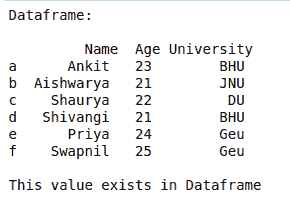
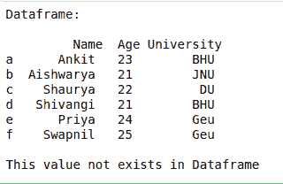
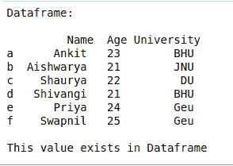
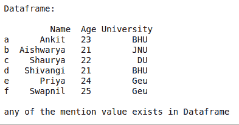

# 检查数据帧中是否存在使用&而不是 Python-Pandas 中运算符

的值

> 原文:[https://www . geesforgeks . org/check-if-a-value-exist-in-a-data frame-use-in-not-in-operator-in-python-pandas/](https://www.geeksforgeeks.org/check-if-a-value-exists-in-a-dataframe-using-in-not-in-operator-in-python-pandas/)

在本文中，让我们讨论如何检查数据框中是否存在给定值。
**方法 1 :** 使用 in 运算符检查数据框中是否存在元素。

## 蟒蛇 3

```py
# import pandas library
import pandas as pd

# dictionary with list object in values
details = {
    'Name' : ['Ankit', 'Aishwarya', 'Shaurya',
              'Shivangi', 'Priya', 'Swapnil'],
    'Age' : [23, 21, 22, 21, 24, 25],
    'University' : ['BHU', 'JNU', 'DU', 'BHU', 'Geu', 'Geu'],
}

# creating a Dataframe object
df = pd.DataFrame(details, columns = ['Name', 'Age', 'University'],
                  index = ['a', 'b', 'c', 'd', 'e', 'f'])

print("Dataframe: \n\n", df)

# check 'Ankit' exist in dataframe or not
if 'Ankit' in df.values :
    print("\nThis value exists in Dataframe")

else :
    print("\nThis value does not exists in Dataframe")
```

**输出:**



**方法 2:** 使用 not in 运算符检查数据框中是否不存在元素。

## 蟒蛇 3

```py
# import pandas library
import pandas as pd

# dictionary with list object in values
details = {
    'Name' : ['Ankit', 'Aishwarya', 'Shaurya', 'Shivangi', 'Priya', 'Swapnil'],
    'Age' : [23, 21, 22, 21, 24, 25],
    'University' : ['BHU', 'JNU', 'DU', 'BHU', 'Geu', 'Geu'],
}

# creating a Dataframe object
df = pd.DataFrame(details, columns = ['Name', 'Age', 'University'],
                  index = ['a', 'b', 'c', 'd', 'e', 'f'])

print("Dataframe: \n\n", df)

# check 'Ankit' exist in dataframe or not
if 'Ankita' not in df.values :
    print("\nThis value not exists in Dataframe")

else :
    print("\nThis value exists in Dataframe")

```

**输出:**



**方法 3 :** 使用数据框的 [**isin()**](https://www.geeksforgeeks.org/python-pandas-dataframe-isin/) 方法检查数据框中是否存在单个元素。

## 蟒蛇 3

```py
# import pandas library
import pandas as pd

# dictionary with list object in values
details = {
    'Name' : ['Ankit', 'Aishwarya', 'Shaurya', 'Shivangi', 'Priya', 'Swapnil'],
    'Age' : [23, 21, 22, 21, 24, 25],
    'University' : ['BHU', 'JNU', 'DU', 'BHU', 'Geu', 'Geu'],
}

# creating a Dataframe object
df = pd.DataFrame(details, columns = ['Name', 'Age', 'University'],
                  index = ['a', 'b', 'c', 'd', 'e', 'f'])

print("Dataframe: \n\n", df)

# isin() methods return Boolean
# Dataframe of given Dimension
# first any() will return boolean series
# and 2nd any() will return single bool value
res = df.isin(['Ankit']).any().any()

if res :
    print("\nThis value exists in Dataframe")

else :
    print("\nThis value does not exists in Dataframe")
```

**输出:**



**方法 4 :** 使用数据框的 **isin()** 方法检查数据框中是否存在任何给定值。

## 蟒蛇 3

```py
# import pandas library
import pandas as pd

# dictionary with list object in values
details = {
    'Name' : ['Ankit', 'Aishwarya', 'Shaurya', 'Shivangi', 'Priya', 'Swapnil'],
    'Age' : [23, 21, 22, 21, 24, 25],
    'University' : ['BHU', 'JNU', 'DU', 'BHU', 'Geu', 'Geu'],
}

# creating a Dataframe object
df = pd.DataFrame(details, columns = ['Name', 'Age', 'University'],
                  index = ['a', 'b', 'c', 'd', 'e', 'f'])

print("Dataframe: \n\n", df)

# isin() methods return Boolean Dataframe
# of given Dimension first any() will return
# boolean series and 2nd any() will return
# single boolean value
res = df.isin(['Ankit', 'good', 30]).any().any()

if res :
    print("\nany of the mention value exists in Dataframe")

else :
    print("\nNone of thses values exists in Dataframe")
```

**输出:**

