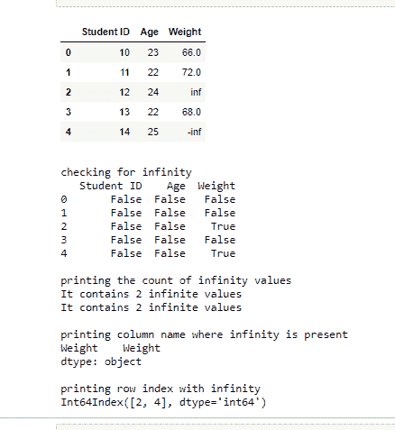

# 检查 Python 中的数据框是否包含无穷大–熊猫

> 原文:[https://www . geesforgeks . org/check-if-data frame-contains-infinity-in-python-pandas/](https://www.geeksforgeeks.org/check-if-dataframe-contains-infinity-in-python-pandas/)

**先决条件:**T2】熊猫

在各种情况下，数据帧可以包含无穷大作为值。本文讨论如何在数据框中跟踪不定式。

### 方法

*   导入模块
*   创建一个数据框架，对于本文来说，这是使用字典完成的。对于数据中包含无穷大，导入 NumPy 模块，正无穷大使用 **np.inf** ，负无穷大使用 **-np.inf** 。
*   根据您的要求，从下面提到的方法中选择合适的方法。

**方法 1:** 使用 [DataFrame.isinf()](https://www.geeksforgeeks.org/numpy-isinf-python/) 功能检查数据帧是否包含无穷大。它返回布尔值。如果它包含任何无穷大，它将返回真。否则，它将返回 False。

**语法:**

```py
isinf(array [, out])
```

使用这种方法本身，我们可以获得更多关于数据帧中无限存在的信息:

*   检查无限值
*   计算无穷大值的数量
*   检索以无穷大作为值的列名
*   检索以无穷大为值的行索引

**示例:**

## 蟒蛇 3

```py
# Import required libraries

import pandas as pd
import numpy as np

# Create dataframe using dictionary
data = {'Student ID': [10, 11, 12, 13, 14], 
        'Age': [23, 22, 24, 22, 25],
        'Weight': [66, 72, np.inf, 68, -np.inf]}

df = pd.DataFrame(data)

display(df)

# checking for infinity
print()
print("checking for infinity")

ds = df.isin([np.inf, -np.inf])
print(ds)

# printing the count of infinity values
print()
print("printing the count of infinity values")

count = np.isinf(df).values.sum()
print("It contains " + str(count) + " infinite values")

# counting infinity in a particular column name
c = np.isinf(df['Weight']).values.sum()
print("It contains " + str(c) + " infinite values")

# printing column name where infinity is present
print()
print("printing column name where infinity is present")
col_name = df.columns.to_series()[np.isinf(df).any()]
print(col_name)

# printing row index with infinity
print()
print("printing row index with infinity ")

r = df.index[np.isinf(df).any(1)]
print(r)
```

**输出:**



**方法 2:** 使用**[NP . is inite(data frame _ name)](https://www.geeksforgeeks.org/numpy-isfinite-python/)**检查无限值的存在。它返回布尔值。对于无限值，它将返回 False，对于有限值，它将返回 True。****

******语法:******

```py
**isfinite(array [, out])**
```

******示例:******

## ****蟒蛇 3****

```py
**# Import required libraries

import pandas as pd
import numpy as np

# Create dataframe using dictionary
data = {'Student ID': [10, 11, 12, 13, 14], 'Age': [
    23, 22, 24, 22, 25], 'Weight': [66, 72, np.inf, 68, -np.inf]}

df = pd.DataFrame(data)

d = np.isfinite(df)

display(d)**
```

******输出:******

********