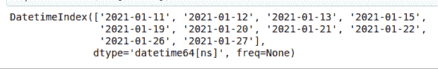

# 查看熊猫的失踪日期

> 原文:[https://www . geesforgeks . org/check-失踪熊猫日期/](https://www.geeksforgeeks.org/check-missing-dates-in-pandas/)

在这篇文章中，我们将学习如何检查熊猫中丢失的日期。

### 方法:

*   使用 **pd 从列表字典中创建数据帧。DataFrame()** 接受数据作为其参数。注意，在这里，字典由两个列表组成，名为*日期*和*姓名。*两者长度相同，给定日期顺序中有部分日期缺失(从 *2021-01-18* *到 2021-01-25* )。我们也可以为这个方法提供一个 CSV 文件，而不是创建我们自己的数据集。
*   [**df . set _ index()**](https://www.geeksforgeeks.org/python-pandas-dataframe-set_index/)**方法将日期设置为我们创建的数据框的索引。可以简单地使用 *print(df)* 打印数据帧，以查看将*日期*设置为索引前后的数据帧。**

> ****语法:** DataFrame.set_index(键，删除=真，追加=假，插入=假)**

**将*日期*设为索引前:**

<figure class="table">

|   | **日期** | **名称** |
| --- | --- | --- |
| **0** | 2021-01-18  | 贾（中国姓氏） |
| **1** | 2021-01-20 | 坦尼娅（Tatiana 的昵称）（f.） |
| **2** | 2021-01-23 | 罗汉 |
| **3** | 2021-01-25  | 萨姆（男子名） |

</figure>

**将*日期*设为索引后:**

<figure class="table">

|   | **名称** |
| --- | --- |
| **日期** |   |
| --- | --- |
| **2021-01-18** | 贾（中国姓氏） |
| **2021-01-20** | 坦尼娅（Tatiana 的昵称）（f.） |
| **2021-01-23** | 罗汉 |
| **2021-01-25** | 萨姆（男子名） |

</figure>

*   **现在，一旦我们将日期设置为索引，我们就将给定的日期列表转换为 *DateTime 对象*。最初，我们列表中的日期是需要转换成 DateTime 对象的字符串。熊猫为我们提供了一个名为 [**to_datetime()**](https://www.geeksforgeeks.org/python-pandas-to_datetime/) 的方法，将*字符串格式的日期和时间*转换为 *DateTime 对象*。**

> ****语法:** pandas.to_datetime(arg，错误='raise '，格式=None)**

*   **[**PD . date _ range()**](https://www.geeksforgeeks.org/python-pandas-date_range-method/)**方法接受一个*开始日期*，一个*结束日期*，并在该范围内创建日期序列。****

> ******语法:**pandas . date _ range(start =无，end =无，freq =无)****

*   ****[**熊猫。Index . difference()**](https://www.geeksforgeeks.org/python-pandas-index-difference/)**返回一个新的 Index，其索引元素不在其他元素中。因此，通过使用 ***pd.date_range(开始日期、结束日期)。差异(日期)*** ，我们得到所有不在我们的日期列表中的日期。返回的数据类型是日期时间 64 数据的*不可变数组。*******

> ******语法:**熊猫。索引.差异(其他，排序=真)****

******例 1:******

## ****蟒蛇 3****

```py
**#import pandas
import pandas as pd

# A dataframe from a dictionary of lists
data = {'Date': ['2021-01-18', '2021-01-20',
                 '2021-01-23', '2021-01-25'],
        'Name': ['Jia', 'Tanya', 'Rohan', 'Sam']}
df = pd.DataFrame(data)

# Setting the Date values as index
df = df.set_index('Date')

# to_datetime() method converts string
# format to a DateTime object
df.index = pd.to_datetime(df.index)

# dates which are not in the sequence
# are returned
print(pd.date_range(
  start="2021-01-18", end="2021-01-25").difference(df.index))**
```

******输出:******

****最后，我们得到了 2021-01-18 和 2021-01-25 之间缺少的所有日期。****

> ****DatetimeIndex（['2021-01-19'， '2021-01-21'， '2021-01-22'， '2021-01-24']， dtype='datetime64[ns]'， freq=None）****

******例 2:******

****让我们考虑另一个例子。但是，这次我们不会将日期设置为索引，而是在 *pd.date_range()* 函数中分配 *freq='B'* (工作日频率)。****

****就像前面的例子一样，我们从列表字典中创建一个数据框架。但是，这次我们没有将日期值设置为索引。相反，我们将“总人数”列设置为我们的索引值。使用 *pd.date_range()* 函数，该函数以开始日期、结束日期和频率为参数，我们提供这些值。我们设置频率= 'B '(工作日频率)以便省略周末。最后，*熊猫。Index.difference()* 将*日期*列作为一个参数，并返回不在给定值集中的所有值。****

## ****蟒蛇 3****

```py
**#import pandas
import pandas as pd

# A dataframe from a dictionary of lists
d = {'Date': ['2021-01-10', '2021-01-14', '2021-01-18',
              '2021-01-25', '2021-01-28', '2021-01-29'],
     'Total People': [20, 21, 19, 18, 13, 56]}
df = pd.DataFrame(d)

# Setting the Total People as index
df = df.set_index('Total People')

# to_datetime() method converts string
# format to a DateTime object
df['Date'] = pd.to_datetime(df['Date'])

# dates which are not in the sequence
# are returned
my_range = pd.date_range(
  start="2021-01-10", end="2021-01-31", freq='B')

print(my_range.difference(df['Date']))**
```

******输出:******

********

****请注意，除了 2021-01-23、2021-01-24 和 2021-01-30 之外，所有缺失的值都会返回，因为我们设置了 *freq='B'* ，省略了所有的周末。****