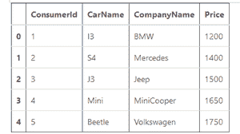

# 检查熊猫数据框中是否存在给定的列

> 原文:[https://www . geesforgeks . org/check-给定列是否存在于熊猫数据框中/](https://www.geeksforgeeks.org/check-whether-a-given-column-is-present-in-a-pandas-dataframe-or-not/)

考虑一个包含 4 列的数据框:“消费”、“名称”、“公司名称”和“价格”。我们必须确定数据框中是否存在特定的列。

在这个 pandas 程序中，我们使用 **Dataframe.columns** 属性返回给定数据帧的列标签。

> **语法:**数据框.列
> 
> **参数:**无
> 
> **返回:**列名

让我们创建一个数据帧:
**代码:**

## 计算机编程语言

```
# import pandas library
import pandas as pd

# dictionary
d = {'ConsumerId': [1, 2, 3,
                    4, 5],
     'CarName': ['I3', 'S4', 'J3',
                 'Mini', 'Beetle'],
     'CompanyName': ['BMW','Mercedes', 'Jeep',
                     'MiniCooper', 'Volkswagen'],
     'Price': [1200, 1400, 1500,
               1650, 1750]
    }

# create a dataframe
df = pd.DataFrame(d)

# show the dataframe
df
```

**输出:**



**示例 1:** 检查数据框中是否存在“消费”列。

## 计算机编程语言

```
if 'ConsumerId' in df.columns :
  print('ConsumerId column is present')

else:
  print('ConsumerId column is not present')
```