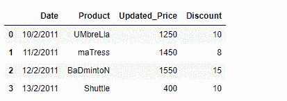
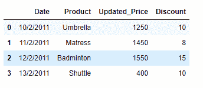

# 清除给定熊猫数据框中的字符串数据

> 原文:[https://www . geesforgeks . org/clean-the-string-in-the-given-pandas-data frame/](https://www.geeksforgeeks.org/clean-the-string-data-in-the-given-pandas-dataframe/)

众所周知，在当今世界，各种各样的公司都在使用数据分析。在处理数据时，我们可能会遇到任何需要开箱即用的评估方法的问题。现实生活中的大多数数据都包含实体名称或其他名词。这些名称的格式可能不正确。在这篇文章中，我们将讨论清理这些数据的方法。

假设我们正在处理一个基于电子商务的网站的数据。产品名称的格式不正确。正确格式化数据，使得没有前导空格和尾随空格，并且所有产品的首字母都是大写字母。

**解决方案#1:** 很多时候我们会遇到这样的情况，我们需要编写适合手头任务的自定义函数。

```
# importing pandas as pd
import pandas as pd

# Create the dataframe
df = pd.DataFrame({'Date':['10/2/2011', '11/2/2011', '12/2/2011', '13/2/2011'],
                   'Product':[' UMbreLla', '  maTress', 'BaDmintoN ', 'Shuttle'],
                   'Updated_Price':[1250, 1450, 1550, 400],
                   'Discount':[10, 8, 15, 10]})

# Print the dataframe
print(df)
```

**输出:**



现在我们将编写自己的定制函数来解决这个问题。

```
def Format_data(df):
    # iterate over all the rows
    for i in range(df.shape[0]):

        # reassign the values to the product column
        # we first strip the whitespaces using strip() function
        # then we capitalize the first letter using capitalize() function
        df.iat[i, 1]= df.iat[i, 1].strip().capitalize()

# Let's call the function
Format_data(df)

# Print the Dataframe
print(df)
```

**输出:**


**解决方案#2 :** 现在我们将看到使用熊猫`DataFrame.apply()`功能的更好、更高效的方法。

```
# importing pandas as pd
import pandas as pd

# Create the dataframe
df = pd.DataFrame({''Date':['10/2/2011', '11/2/2011', '12/2/2011', '13/2/2011'],
                   'Product':[' UMbreLla', '  maTress', 'BaDmintoN ', 'Shuttle'],
                   'Updated_Price':[1250, 1450, 1550, 400],
                   'Discount':[10, 8, 15, 10]})

# Print the dataframe
print(df)
```

**输出:**


让我们使用熊猫`DataFrame.apply()`功能以正确的格式格式化产品名称。在熊猫`DataFrame.apply()`函数中，我们将使用λ函数。

```
# Using the df.apply() function on product column
df['Product'] = df['Product'].apply(lambda x : x.strip().capitalize())

# Print the Dataframe
print(df)
```

**输出:**
