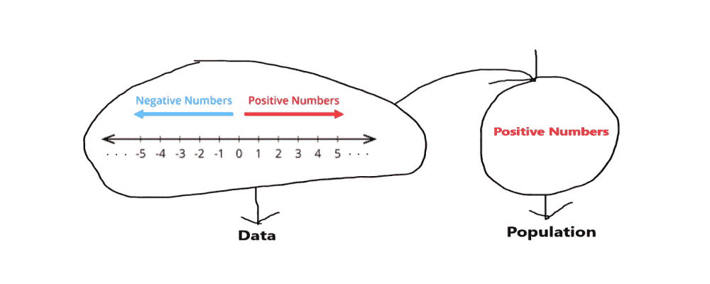
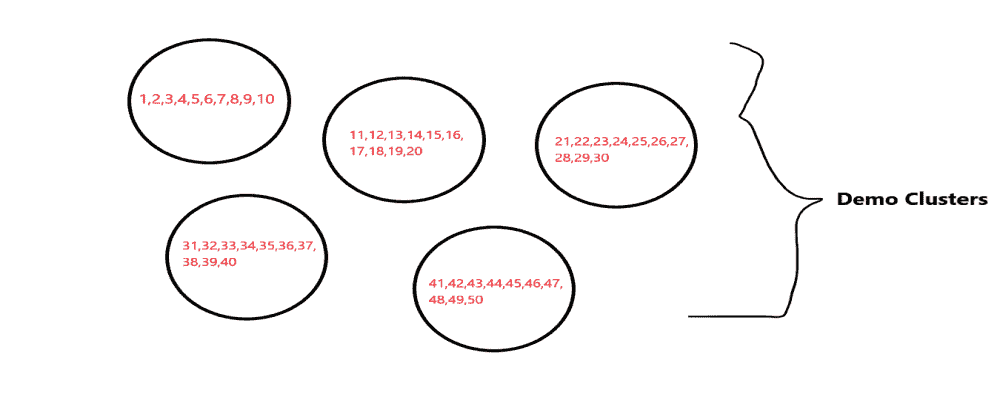
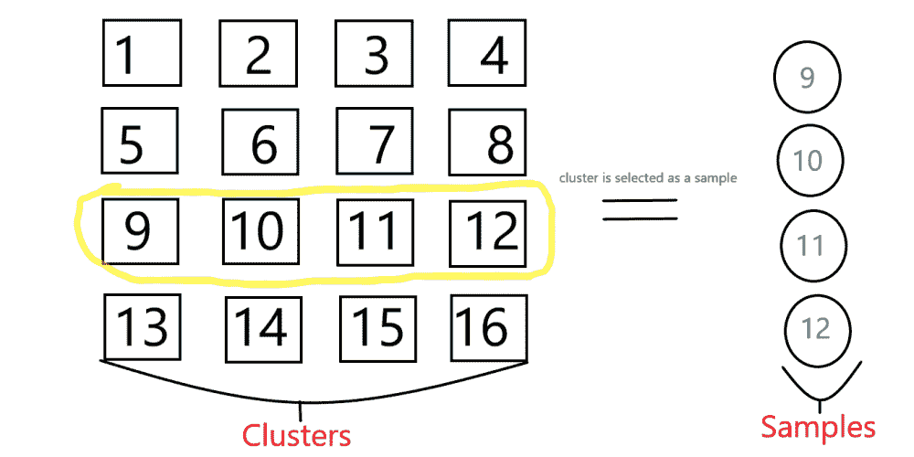
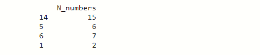
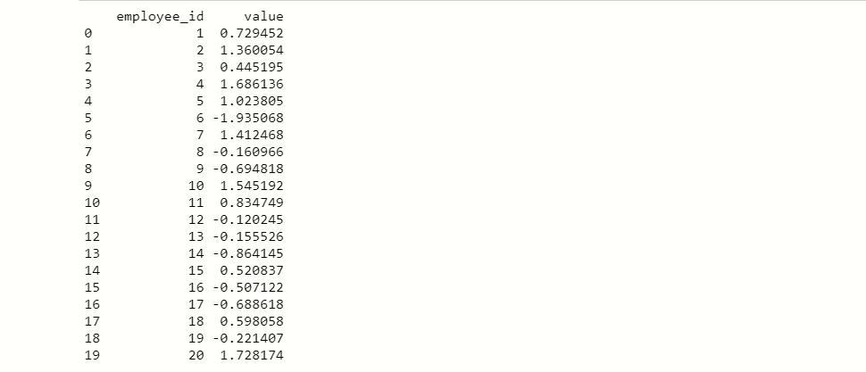
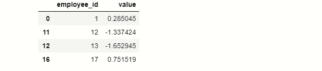

# 大熊猫集群采样

> 原文:[https://www.geeksforgeeks.org/cluster-sampling-in-pandas/](https://www.geeksforgeeks.org/cluster-sampling-in-pandas/)

**采样**是一种方法，我们从一个大的群体中收集或选择一个小的数据集合，而不需要找到集合中每个个体的意义。我们正在从人群中进行数据采样，因为我们无法从整个人群中收集数据。如果我们完成了抽样，那么我们就可以将人口控制在可管理的范围内，并有助于将由于人口数量庞大而导致的误差降到最低。

**我们可以用几种方法做抽样，这里只讨论整群抽样:**

### 聚类采样:

整群抽样是一种概率抽样，在这种抽样中，总体的每一个元素都被同等地选择，我们使用总体的子集作为抽样部分，而不是使用单个元素进行抽样。

将群体划分为子集或亚组，这些子集或亚组被认为是**聚类**，并且从聚类的数量中，我们选择要执行的下一步的单个聚类。

**现在查看对群体执行聚类采样所采取的步骤:**

**第一步:**定义和识别目标人群。

这是我们进行采样的第一步，我们必须从人群中明确选择目标区域。

为了用通俗易懂的语言理解，我们举一个整数的例子，整数是可以写成没有小数形式的数字，就像所有的负数和正数(-1，-4，-8，3，5，2，0……)一样，所以我们把所有的整数作为我们的数据，从这些数据中我们必须选择我们的目标区域来执行采样。从这些整数数据，我们可以瞄准所有的正数或所有的负数。

这里我们假设我们的目标区域都是正数，这意味着我们将整数数据中的所有正数作为样本。



**第二步:**取样方法。

这里我们使用概率聚类抽样，因为总体中的每个元素都有同等的选择机会。

**第三步:**将样本分成簇。

在我们选择采样方法后，我们将样本划分为聚类，这是执行聚类采样的一个重要部分，我们必须创建一个高质量的聚类，因为它们在采样后会产生更好的准确性。我们提醒，我们正在生产的集群具有更好的影响，这意味着它们对我们的人口有很好的代表性。集群必须平均和相似地分布，因为它们之间没有重复。理想情况下，每个集群应该是整个人口的一个小型代表。



**第四步:**采集数据。

在执行上述步骤后的最后一步中，我们从样本中收集所需的数据。

我们举一个集群抽样的例子，其中我们取 1 到 n 个自然数组成集群，然后从这个集群中，我们选择随机的单个集群进行抽样。



**N=16，**所以我们从 1 到 16 中抽取样本，然后从随机的聚类中选择一个聚类作为样本，每个聚类有 4 个数字。

**例 1:**

## 蟒蛇 3

```py
# import pandas
import pandas as pd

# import numpy
import numpy as np

# creating dictionary of data
data = {'N_numbers':np.arange(1,16)}

# creating dataframe
df = pd.DataFrame(data)

# sample of data
samples = df.sample(4)
print(samples)
```

**输出:**



4 个数字的随机样本形成 1-16 个数字的集群。

在这个输出中，我们看到，从具有随机数的 N-numbers 列中，顺便说一下，这是我们的随机集群，包含 4 个样本。借助**样本()**设置单个聚类呈现的样本数量。

**例 2:**

## 蟒蛇 3

```py
# code
# importing modules
import pandas as pd
import numpy as np

#creating dictionary of data
dic_data = {'employee_id':np.arange(1,21),
                  'value':np.random.randn(20)}

# creating DataFrame from dictonary
df = pd.DataFrame(dic_data)
print(df)
```

**输出:**



在这里，我们创建了包含 20 个员工 id 的 DataFrame df，每个 id 都有随机值。从数据集 **df** 、中，我们取一个包含特定 4 个随机样本的随机聚类。

**代码:**

## 蟒蛇 3

```py
# code
# import pandas 
import pandas as pd

# import numpy 
import numpy as np

# creating samples
samples = df.sample(4).sort_values(by='employee_id')

# show samples
print(samples)
```

**输出:**



这些是随机选择的员工

正如您在我们的输出中看到的，我们收集了 4 个随机员工的数据，其中包含他们的 employee_id 和值。首先，我们创建一个样本变量，然后给它分配一个 4 个随机雇员的样本，作为我们的数据。