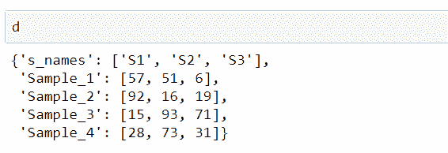
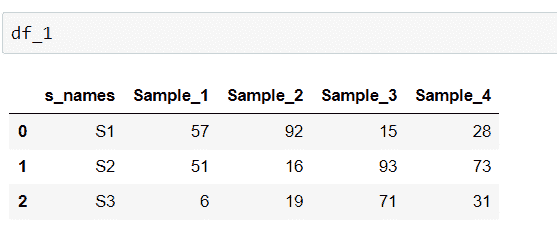
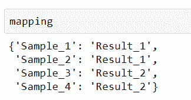
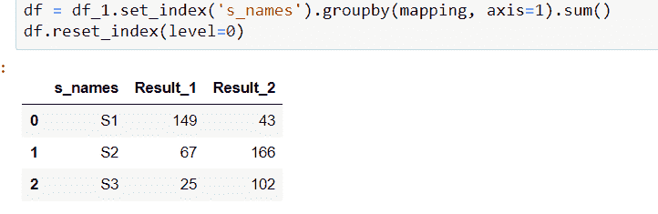
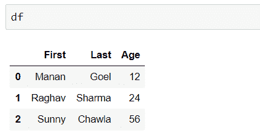
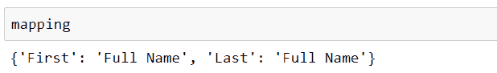
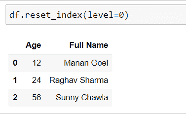

# 折叠熊猫中的多列

> 原文:[https://www . geesforgeks . org/collapse-多列熊猫/](https://www.geeksforgeeks.org/collapse-multiple-columns-in-pandas/)

在熊猫中操作数据框时，我们可能会遇到折叠列的情况。让它成为
多列的累积数据，或者根据其他要求折叠。让我们看看如何折叠熊猫中的多个列。

按照以下步骤折叠熊猫中的多个列:

**第一步:**装载 numpy 和 Pandas。
**步骤 2:** 创建随机数据，并使用它们创建熊猫数据框。
**步骤#3:** 通过为每个列表创建一个带有名称的字典，将多个列表转换为单个数据框。
**第四步:**然后用熊猫数据框成字典。带有数据列和名称列的数据框已准备好。
**步骤 5:** 指定要折叠的列。这可以通过将映射指定为字典来实现，其中键是要组合或折叠的列的名称，值是结果列的名称。

**例 1:**

```py
# Python program to collapse
# multiple Columns using Pandas
import pandas as pd

# sample data
n = 3
Sample_1 = [57, 51, 6]
Sample_2 = [92, 16, 19]
Sample_3 = [15, 93, 71]
Sample_4 = [28, 73, 31]

sample_id = zip(["S"]*n, list(range(1, n + 1)))

s_names = [''.join([w[0], str(w[1])]) for w in sample_id]

d = {'s_names': s_names, 'Sample_1': Sample_1, 
     'Sample_2': Sample_2, 'Sample_3': Sample_3,
     'Sample_4': Sample_4}

df_1 = pd.DataFrame(d)

mapping = {'Sample_1': 'Result_1',
           'Sample_2': 'Result_1', 
           'Sample_3': 'Result_2', 
           'Sample_4': 'Result_2'}

df = df_1.set_index('s_names').groupby(mapping, axis = 1).sum()

df.reset_index(level = 0)
```

**输出:**
   

**例 2:**

```py
# Python program to collapse
# multiple Columns using Pandas
import pandas as pd
df = pd.DataFrame({'First': ['Manan ', 'Raghav ', 'Sunny '],
                   'Last': ['Goel', 'Sharma', 'Chawla'],
                   'Age':[12, 24, 56]})

mapping = {'First': 'Full Name', 'Last': 'Full Name'}

df = df.set_index('Age').groupby(mapping, axis = 1).sum()

df.reset_index(level = 0)
```

**输出:**
  