# 用谷歌表单和熊猫收集数据

> 原文:[https://www . geeksforgeeks . org/用谷歌表单和熊猫收集数据/](https://www.geeksforgeeks.org/collecting-data-with-google-forms-and-pandas/)

在本文中，我们将讨论如何使用 Pandas 从谷歌表单中收集数据。

### 需要的模块

*   **pydrive:** 这是用来简化很多常见的 Google Drive API 任务的。要安装此软件，请在终端中键入以下命令。

```py
pip install pydrive
```

*   **xlrd:** 该模块用于从电子表格中提取数据。要安装此软件，请在终端中键入以下命令。

```py
pip install xlrd
```

*   [**openpyxl**](https://www.geeksforgeeks.org/python-reading-excel-file-using-openpyxl-module/) **:这是一个读写 Excel 的 Python 库。要安装此软件，请在终端中键入以下命令。**

```py
pip install openpyxl
```

### 入门指南

整个过程的第一个重要部分是创建一个谷歌表单。访问[这个链接](https://docs.google.com/forms/)创建一个新的表单。

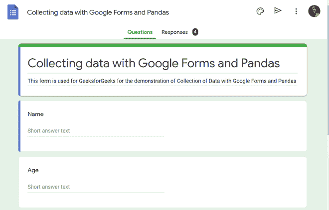

谷歌表单中的表单创建

设置完问题后，单击“发送”按钮发布表单。要访问此谷歌表单，请点击此处。

下一步是向谷歌验证我们的 Python 脚本和本地环境，并通过启用谷歌云平台中的谷歌驱动应用编程接口从谷歌驱动访问谷歌表单数据。请遵循以下步骤:

1.  转到谷歌表单
2.  响应选项卡，
3.  单击电子表格图标
4.  并为我们的谷歌表单创建一个新的目标电子表格。

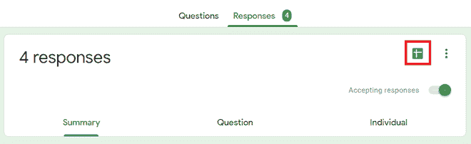

链接一个新的电子表格和谷歌表格

该电子表格将被创建并存储在谷歌驱动器中。我们必须集成谷歌驱动和 Python 环境。首先，我们必须向谷歌认证。

### **认证谷歌驱动应用编程接口**

现在，要使用谷歌驱动应用编程接口，我们必须设置我们的帐户，启用谷歌驱动应用编程接口，并获得我们的 **client_secrets.json** 密钥。

1.进入[谷歌云平台控制台](https://console.cloud.google.com/)，点击 GCP 工具栏上的新建项目/项目→新建项目。


单击项目名称，然后选择新建项目

2.输入我们项目的名称，然后单击“创建”。

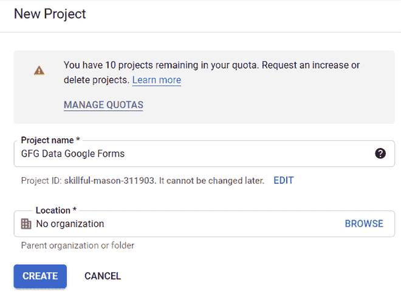

创建 GCP 项目

3.在我们项目的主屏幕中，单击左上角的导航栏，然后单击“应用编程接口和服务”，并选择“审核同意屏幕”。

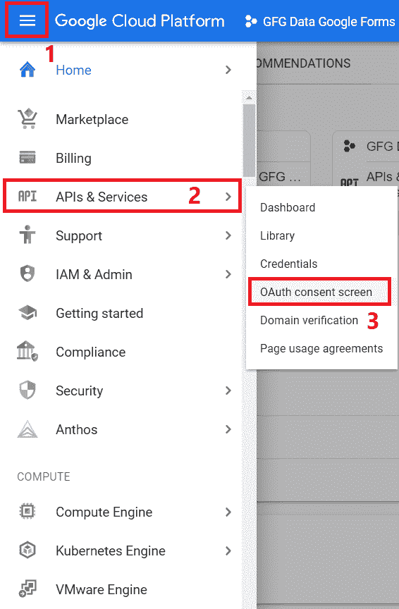

导航到 Oauth 同意屏幕

4.在审核同意屏幕主页中，选择外部，然后单击创建

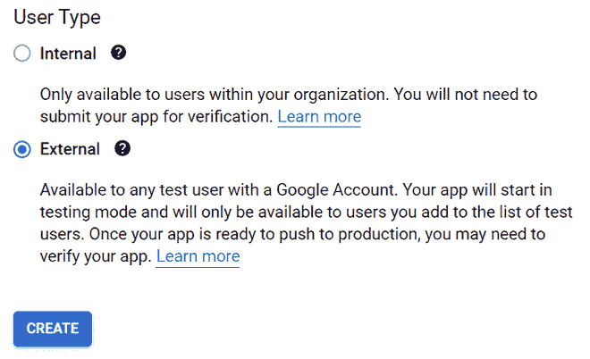

Oauth 初始步骤

5.在下一个屏幕中，输入强制详细信息，包括应用程序名称、用户支持电子邮件和开发人员联系信息。点击“保存并继续”，进入摘要页面。

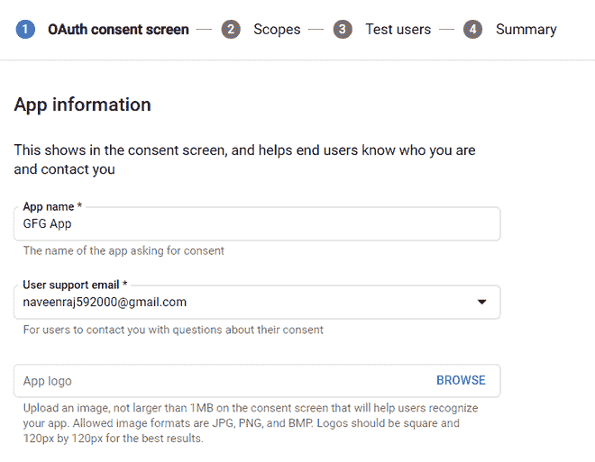

应用详情

6.在摘要屏幕中，单击“返回仪表板”。我们现在可以选择发布我们的应用程序。现在，我们准备将我们的应用程序推向生产。

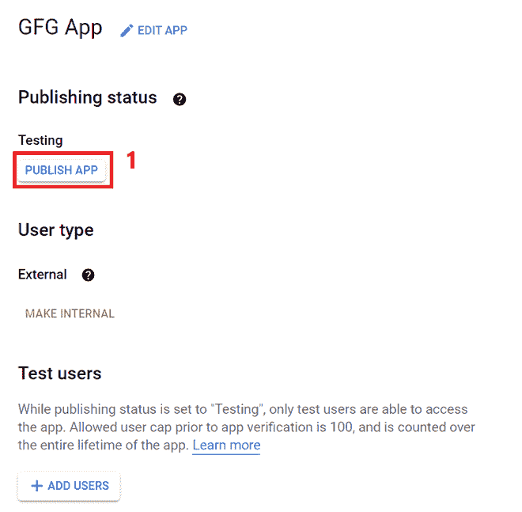

发布我们的应用

7.现在我们已经发布了我们的应用程序，点击搜索栏，搜索谷歌驱动应用程序接口。选择谷歌驱动应用编程接口并启用服务。

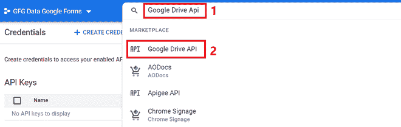

搜索谷歌驱动应用编程接口服务

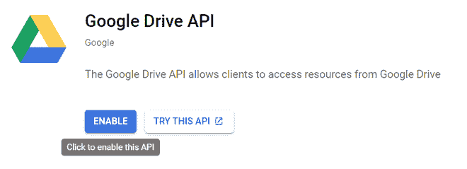

启用谷歌驱动应用编程接口

8.现在我们已经发布了我们的应用程序并启用了谷歌驱动应用程序接口，点击导航栏，在应用程序接口和服务中，选择凭证。

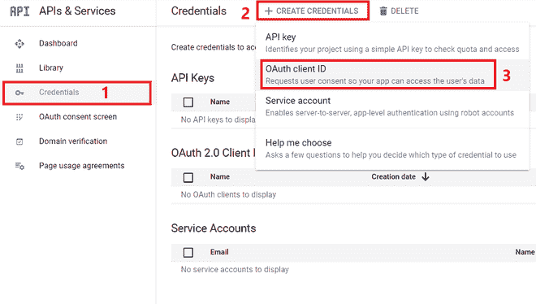

创建凭据

9.在 OAuth 客户端标识屏幕中，选择应用程序类型作为桌面应用程序，输入名称，然后单击创建。

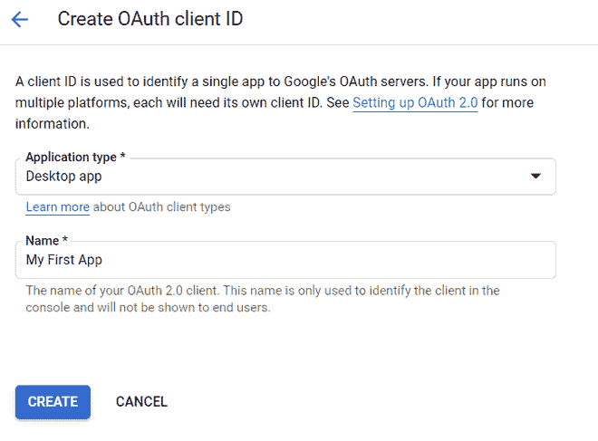

创建授权客户端标识

9.我们将被重定向到凭据主页，在那里我们将能够找到我们的 OAuth 客户端标识。单击下载密钥选项并保存。名为 **client_secrets.json** 的 JSON 文件

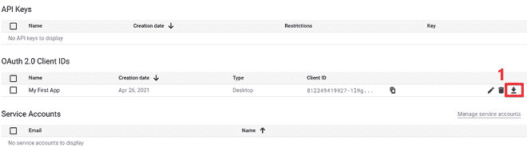

下载密钥

**注意:**这个密钥和下面创建的 Python 文件应该在同一个目录下。

**Python 实现:**

## 蟒蛇 3

```py
from pydrive.auth import GoogleAuth
from pydrive.drive import GoogleDrive
import pandas as pd

# Initializing a GoogleAuth Object
gauth = GoogleAuth()

# client_secrets.json file is verified
# and it automatically handles authentication
gauth.LocalWebserverAuth()

# GoogleDrive Instance is created using
# authenticated GoogleAuth instance
drive = GoogleDrive(gauth)

# Initialize GoogleDriveFile instance with file id
file_obj = drive.CreateFile({'id': 'FILE_ID'})
file_obj.GetContentFile('FILE_NAME.xls',
         mimetype='application/vnd.openxmlformats-officedocument.spreadsheetml.sheet')

dataframe = pd.read_excel('FILE_NAME.xls')
print(dataframe)
```

**注意:**用于谷歌表单创建和 Python 环境 GDrive 身份验证的谷歌帐户必须相同

当我们运行代码时，在我们默认的网络浏览器中会弹出一个谷歌身份验证流窗口。我们必须选择我们的谷歌帐户，并继续流动。

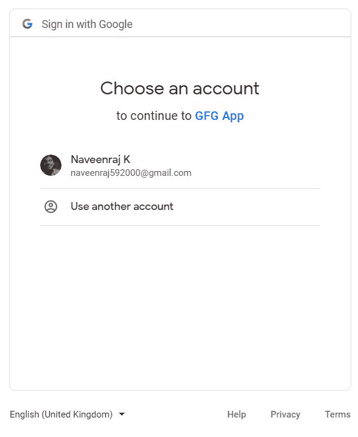

选择我们的谷歌账户

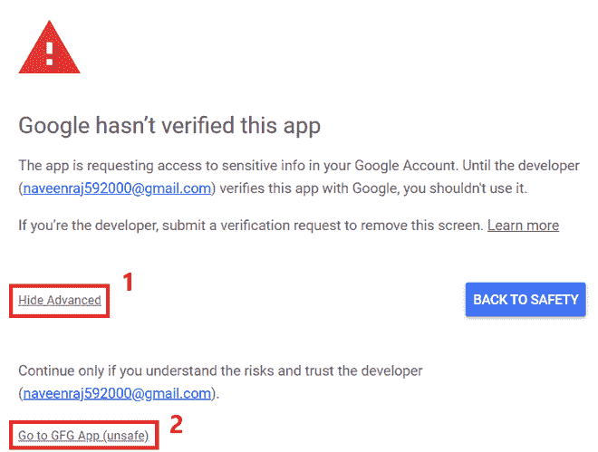

单击高级->转到 GFG 应用程序(不安全)

我们必须允许权限，并再次单击下一屏幕中的允许。

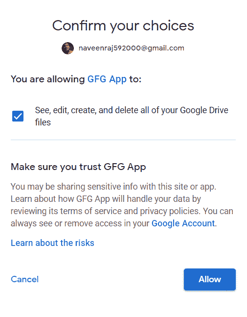

为我们的应用程序启用权限

现在我们将在浏览器中收到一条消息，上面写着“**认证流程已经完成”。**转到我们的 Python 环境，我们将能够看到熊猫数据帧格式的数据。

**输出:**

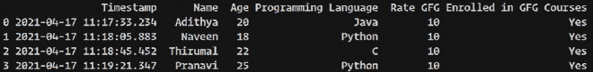

熊猫数据帧通过谷歌驱动应用编程接口从谷歌实时获取