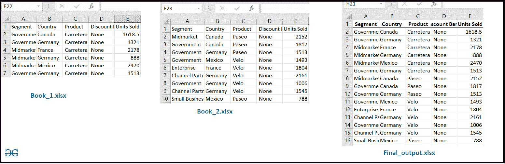

# 将多个 Excel 工作表合并成一个熊猫数据框

> 原文:[https://www . geesforgeks . org/combine-multi-excel-worksheets-in-single-pandas-data frame/](https://www.geeksforgeeks.org/combine-multiple-excel-worksheets-into-a-single-pandas-dataframe/)

**先决条件:** [使用熊猫](https://www.geeksforgeeks.org/working-with-excel-files-using-pandas/)处理 excel 文件

在这些文章中，我们将讨论如何将多个 excel 工作表导入到一个数据框中，并保存到一个新的 excel 文件中。假设我们有两个结构相同的 Excel 文件(Excel_1.xlsx，Excel_2.xlsx)，然后将这两个工作表合并成一个新的 Excel 文件。

**进场:**

*   导入-模块
*   读取 Excel 文件并存储到数据框中
*   将两个数据框连接成一个新的数据框
*   使用[功能将数据框导出到 Excel 文件中](https://www.geeksforgeeks.org/dataframe-to_excel-method-in-pandas/)

**下面是实现。**

## 蟒蛇 3

```py
# import module
import pandas as pd

# Read excel file
# and store into a DataFrame
df1 = pd.read_excel('excel_work\sample_data\Book_1.xlsx')
df2 = pd.read_excel('excel_work\sample_data\Book_2.xlsx')

# concat both DataFrame into a single DataFrame
df = pd.concat([df1, df2])

# Export Dataframe into Excel file
df.to_excel('final_output.xlsx', index=False)
```

**输出:**

