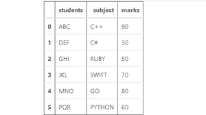
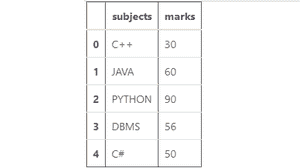
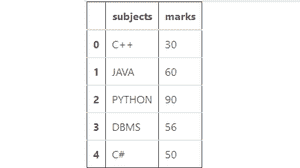

# 将两个熊猫系列组合成一个数据框

> 原文:[https://www . geesforgeks . org/combine-two-pandas-series-in-a-data frame/](https://www.geeksforgeeks.org/combine-two-pandas-series-into-a-dataframe/)

在这篇文章中，我们将学习如何将两个系列组合成一个数据帧？开始之前我们先来看看**什么是系列？**
[**熊猫系列**](https://www.geeksforgeeks.org/python-pandas-series/) 是一个能够保存任何数据类型的一维标注数组。换句话说，熊猫系列只不过是 excel 表格中的一列。

有几种方法可以连接熊猫的两个系列。以下是一些方法:

**方法 1:** 使用[T3【熊猫. concat() 。](https://www.geeksforgeeks.org/how-to-union-pandas-dataframes-using-concat/)

该方法执行所有繁重的提升操作，即沿一个轴执行串联操作，同时对其他轴上的索引(如果有)执行可选的集合逻辑(并集或交集)。

**代号:**

## 大蟒

```py
# import pandas library
import pandas as pd

# this user defines function
# creates a series
# from the passed list.
def createSeries (series_list):

  # create a series
  series_list = pd.Series(series_list)

  return series_list

# create a series of students
students = createSeries(['ABC', 'DEF',
                         'GHI', 'JKL',
                         'MNO', 'PQR'])  
# create a series of subjects
subject = createSeries(['C++', 'C#', 
                        'RUBY', 'SWIFT',
                        'GO', 'PYTHON'])
# create a series of marks
marks = createSeries([90, 30, 
                      50, 70, 
                      80, 60])
# create a dictonary
data = {"students": students,
        "subject": subject,
        "marks": marks}

# Concatenating the series side
# by side as depicted by axis=1
# If you want to concatenate the 
# series one below the other
# change the axis to zero.
df = pd.concat(data,
               axis = 1)

# show the dataframe
df
```

**输出:**



**方法二:**使用 [**系列.**](https://www.geeksforgeeks.org/python-pandas-series-append/) 。

这个方法是连接的快捷方式。该方法沿着轴=0 串联，即行。Series.append()可以连接多个对象。

**代号:**

## 蟒蛇 3

```py
# import pandas library
import pandas as pd

# create a series
a = pd.Series(["ABC", "DEF", 
               "GHI"])

# create a series
b = pd.Series(["JKL", "MNO", 
               "PQR"])

# combine two series then
# create a dataframe
df = pd.DataFrame(a.append(b, 
                  ignore_index = True))
# show the dataframe
df
```

**输出:**


**方法三:**使用 [**熊猫.**](https://www.geeksforgeeks.org/python-pandas-merging-joining-and-concatenating/) 。

熊猫具有高性能的内存连接操作，这与类似于 SQL 的关系数据库管理系统非常相似。合并可用于 dataframe 或命名系列对象之间的所有数据库连接操作。在这种情况下，您必须向系列传递一个额外的参数“名称”。

**代号:**

## 蟒蛇 3

```py
# import pandas library
import pandas as pd

# create a series
a = pd.Series(["C++", "JAVA", 
               "PYTHON", "DBMS",
               "C#"], name = "subjects")

# create a series
b = pd.Series(["30", "60", 
               "90", "56", 
               "50"], name = "marks")

# merge both series 
df = pd.merge(a, b, right_index = True,
               left_index = True)
# show the dataframe
df
```

**输出:**



**方法 4:** 使用**[**data frame . join()**](https://www.geeksforgeeks.org/python-merge-join-and-concatenate-dataframes-using-panda/)**。****

**这种方法也可以用于连接两个系列，但是您必须将一个系列转换为数据帧。**

****代号:****

## **蟒蛇 3**

```py
# import pandas library
import pandas as pd

# create a series
a = pd.Series(["C++", "JAVA", 
               "PYTHON", "DBMS", 
               "C#"], name = "subjects")

# create a series
b = pd.Series(["30", "60", 
               "90", "56", 
               "50"], name = "marks")

# create a dataframe
a = pd.DataFrame(a)

# add series 'b' 
# into dataframe 'a'
df = a.join(b)

# show the dataframe
df
```

****输出:****

****