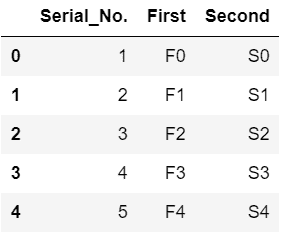
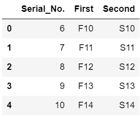
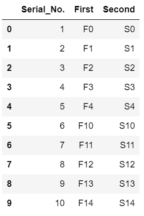
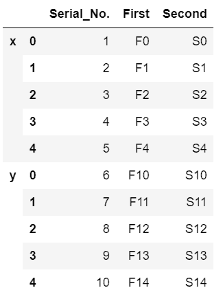
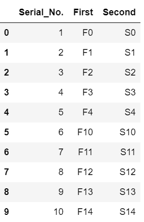

# 结合数据帧和熊猫

> 原文:[https://www . geesforgeks . org/combining-data frames-with-pandas/](https://www.geeksforgeeks.org/combining-dataframes-with-pandas/)

*熊猫*数据框由三个主要组成部分组成，即数据、行和列。为了组合这些数据帧，*熊猫*提供了多种功能，如 *concat()* 和 *append()* 。

**方法#1:使用**[**concat()**](https://www.geeksforgeeks.org/pandas-concat-function-in-python/)T6】方法

最初，创建两个数据集并将它们转换为数据帧。

## 蟒蛇 3

```py
# import required module
import pandas as pd

# making  a dataset
data1 = {
    'Serial_No.': ['1', '2', '3', '4', '5'],
    'First': ['F0', 'F1', 'F2', 'F3', 'F4'],
    'Second': ['S0', 'S1', 'S2', 'S3', 'S4'],
}

# creating a dataframe
df1 = pd.DataFrame(data1, columns=['Serial_No.', 
                                   'First', 
                                   'Second'])

# display dataframe
df1

# making  a dataset
data2 = {
    'Serial_No.': ['6', '7', '8', '9', '10'],
    'First': ['F10', 'F11', 'F12', 'F13', 'F14'],
    'Second': ['S10', 'S11', 'S12', 'S13', 'S14'],
}

# creating  a dataset
df2 = pd.DataFrame(data2, columns=['Serial_No.', 
                                   'First', 
                                   'Second'])

# display dataset
df2
```

**输出:**

 

现在，连接两个数据帧，我们将使用 *concat()* 来组合两个数据帧。如果*忽略 _ 索引=真*，df 的索引将是连续的。

## 蟒蛇 3

```py
# combining the two dataframes
df = pd.concat([df1, df2], ignore_index=True)

# display combined dataframes
df
```

**输出:**



使用键，我们可以指定数据帧的标签。

## 蟒蛇 3

```py
# we can also separate 2 datasets using keys
frames = [df1, df2]
df_keys = pd.concat(frames, keys=['x', 'y'])

# display dataframe
df_keys
```

**输出:**



**方法 2:使用** [**追加()**](https://www.geeksforgeeks.org/python-pandas-dataframe-append/) **方法**

最初，创建两个数据集并将它们转换为数据帧。

## 蟒蛇 3

```py
# import required module
import pandas as pd

# making  a dataset
data1 = {
    'Serial_No.': ['1', '2', '3', '4', '5'],
    'First': ['F0', 'F1', 'F2', 'F3', 'F4'],
    'Second': ['S0', 'S1', 'S2', 'S3', 'S4'],
}

# creating a dataframe
df1 = pd.DataFrame(data1, columns=['Serial_No.', 
                                   'First', 
                                   'Second'])

# display dataframe
df1

# making  a dataset
data2 = {
    'Serial_No.': ['6', '7', '8', '9', '10'],
    'First': ['F10', 'F11', 'F12', 'F13', 'F14'],
    'Second': ['S10', 'S11', 'S12', 'S13', 'S14'],
}

# creating  a dataset
df2 = pd.DataFrame(data2, columns=['Serial_No.', 
                                   'First', 
                                   'Second'])

# display dataset
df2
```

**输出:**

 

*dataframe.append()* 方法执行合并两个数据帧的操作，类似于*contact()*方法。

## 蟒蛇 3

```py
# combining dataframes
result = df1.append(df2, sort=False, ignore_index=True)

# display combined dataframe
result
```

**输出:**

