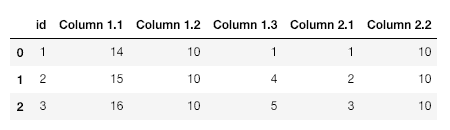
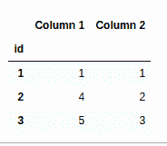
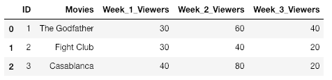
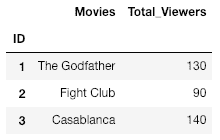

# 用字典组合 Pandas groupby 中的多列

> 原文:[https://www . geeksforgeeks . org/combining-多列 in-pandas-group by-with-dictionary/](https://www.geeksforgeeks.org/combining-multiple-columns-in-pandas-groupby-with-dictionary/)

让我们看看如何借助不同的例子，使用`groupby` 和字典来组合熊猫中的多个列。

**示例#1:**

```
# importing pandas as pd 
import pandas as pd 

# Creating a dictionary 
d = {'id':['1', '2', '3'],
     'Column 1.1':[14, 15, 16],
     'Column 1.2':[10, 10, 10],
     'Column 1.3':[1, 4, 5],
     'Column 2.1':[1, 2, 3],
     'Column 2.2':[10, 10, 10], }

# Converting dictionary into a data-frame 
df = pd.DataFrame(d)
print(df)
```

**输出:**


```
# Creating the groupby dictionary 
groupby_dict = {'Column 1.1':'Column 1',
                'Column 1.2':'Column 1',
                'Column 1.3':'Column 1',
                'Column 2.1':'Column 2',
                'Column 2.2':'Column 2' }

# Set the index of df as Column 'id'
df = df.set_index('id')

# Groupby the groupby_dict created above 
df = df.groupby(groupby_dict, axis = 1).min()
print(df)
```

**输出:**



**解释**

*   这里，我们将第 1.1 栏、第 1.2 栏和第 1.3 栏归入第 1 栏，将第 2.1 栏、第 2.2 栏归入第 2 栏。
*   请注意，每一列中的输出是分组在一起的每一列的最小值。即在列 1 中，第一行的值是列 1.1 行 1、列 1.2 行 1 和列 1.3 行 1 的最小值。

**例 2:**

```
# importing pandas as pd 
import pandas as pd 

# Create dictionary with data 
dict = {
    "ID":[1, 2, 3],
    "Movies":["The Godfather", "Fight Club", "Casablanca"],
    "Week_1_Viewers":[30, 30, 40],
    "Week_2_Viewers":[60, 40, 80],
    "Week_3_Viewers":[40, 20, 20] };

# Convert dictionary to dataframe
df = pd.DataFrame(dict);
print(df)
```

**输出:**


```
# Create the groupby_dict 
groupby_dict = {"Week_1_Viewers":"Total_Viewers",
           "Week_2_Viewers":"Total_Viewers",
           "Week_3_Viewers":"Total_Viewers",
           "Movies":"Movies" }

df = df.set_index('ID')
df = df.groupby(groupby_dict, axis = 1).sum()
print(df)
```

**输出:**


**说明:**

*   在这里，请注意，即使“电影”没有被合并到另一个列中，它仍然必须出现在 groupby_dict 中，否则它不会出现在最终的数据帧中。
*   为了计算总观众数，我们使用了。sum()函数，将各行的所有值相加。