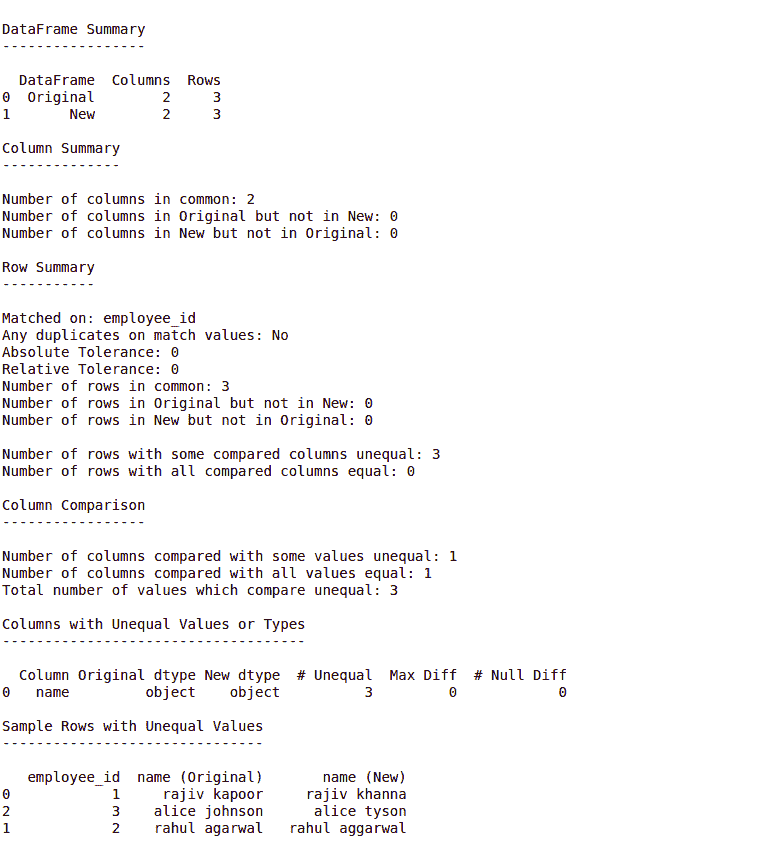

# 使用数据组合

比较熊猫数据帧

> 原文:[https://www . geesforgeks . org/compare-pandas-data frames-using-data compy/](https://www.geeksforgeeks.org/compare-pandas-dataframes-using-datacompy/)

众所周知，Python 是一种多范式的通用语言，由于其广泛的库支持和活跃的社区，被广泛用于数据分析。使用 python 比较两个熊猫数据帧的最常见方法是:

*   使用 difflib
*   使用[模糊不清的](https://www.geeksforgeeks.org/fuzzywuzzy-python-library/)
*   正则表达式匹配

这些方法被经验丰富的新开发人员广泛使用，但是如果我们需要一个报告来查找所有匹配/不匹配的列和行呢？这就是数据组件库出现的时候。

**DataComPy** 是 capitalone 开源的熊猫库。它开始的目的是为了取代熊猫数据帧的过程比较。它将两个数据帧作为输入，并提供给我们一个包含统计数据的人类可读报告，让我们知道这两个数据帧之间的相似和不同之处。

**通过管道 3 安装:**

```py
pip3 install datacompy

```

**示例:**

```py
from io import StringIO
import pandas as pd
import datacompy

data1 = """employee_id, name
1, rajiv kapoor
2, rahul agarwal
3, alice johnson
"""

data2 = """employee_id, name
1, rajiv khanna
2, rahul aggarwal
3, alice tyson
"""

df1 = pd.read_csv(StringIO(data1))
df2 = pd.read_csv(StringIO(data2))

compare = datacompy.Compare(
    df1,
    df2,

    # You can also specify a list
    # of columns
    join_columns = 'employee_id', 

    # Optional, defaults to 0
    abs_tol = 0,

    # Optional, defaults to 0
    rel_tol = 0, 

    # Optional, defaults to 'df1'
    df1_name = 'Original',

    # Optional, defaults to 'df2'
    df2_name = 'New' 
    )

# if ignore_exra_columns=True, 
# the function won't return False
# in case of non-overlapping 
# column names
compare.matches(ignore_extra_columns = False)   

# This method prints out a human-readable 
# report summarizing and sampling 
# differences
print(compare.report())
```

**输出:**



**说明:**

*   在上面的例子中，我们将两个数据框连接在一个匹配的列上。我们也可以通过:`on_index = True`而不是“join_columns”来连接索引。
*   `Compare.matches()`是布尔函数。如果匹配，则返回真，否则返回假。
*   默认情况下，只有在 100%匹配的情况下，数据计算才返回真。我们可以通过将 abs_tol & rel_tol 的值设置为非零值来调整这一点，这使我们能够指定可以容忍的数值之间的偏差量。它们分别代表绝对公差和相对公差。
*   从上面的例子中我们可以看出，DataComPy 是一个非常强大的库&当我们必须生成两个数据帧的比较报告时，它非常有用。