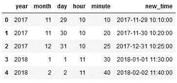

# 用 Python 比较时间戳–熊猫

> 原文:[https://www . geesforgeks . org/comparising-timestamp-in-python-pandas/](https://www.geeksforgeeks.org/comparing-timestamp-in-python-pandas/)

熊猫时间戳相当于 Python 中的 DateTime。时间戳用于熊猫中面向时间序列的数据结构。有时日期和时间在熊猫中作为时间戳提供，或者在时间戳中转换是有益的。并且，需要比较时间戳来知道最新的条目、两个时间戳之间的条目、最早的条目等。各种任务。熊猫时间戳对象之间的比较使用简单的比较运算符进行: >， =。这个差值可以用一个简单的‘–’运算符来计算。

给定时间可以使用*熊猫转换为熊猫时间戳。Timestamp()* 方法。这种方法可以采用各种形式的输入，如类似 DateTime 的字符串(如' 2017-01-01T12 ')、以秒为单位的 Unix epoch(1513393355.5)等。这些值可以是年、月、日、小时、分钟、秒等。用逗号分隔或使用变量名。例如，如果我们想写 2018/2/21 1 1:40:00，我们可以提供(2018，2，21，11，40)作为 Timestamp 方法的参数，也可以写(年=2018，月=2，日=21，小时=11，分钟=40)。未提供的值将被视为零。下面的代码使用这种方法，使用提供的日期和时间信息创建时间戳列“new_time”。

**进场:**

*   创建具有日期和时间值的数据框
*   使用 pandas.timestamp()方法将日期和时间值转换为时间戳值
*   使用常规比较运算符比较所需的时间戳。

**用日期和时间创建熊猫数据框:**

## 蟒蛇 3

```py
import pandas as pd

# Create a dataframe
df = pd.DataFrame({
    'year': [2017, 2017, 2017, 2018, 2018],
    'month': [11, 11, 12, 1, 2],
    'day': [29, 30, 31, 1, 2],
    'hour': [10, 10, 10, 11, 11],
    'minute': [10, 20, 25, 30, 40]})

def time(rows):
    return (pd.Timestamp(rows.year, rows.month,
                         rows.day, rows.hour, rows.minute))

# Create new column with entries of date
# and time provided in timestamp format
df['new_time'] = df.apply(time, axis = 'columns')
display(df)
```

**输出:**



**以下示例中使用了上述 df。**

**示例 1:** 这里，比较“new_time”中的第一个和第二个时间戳，以知道其中最早的时间戳。

## 蟒蛇 3

```py
# Compare first and second timestamps
if df['new_time'][0] <= df['new_time'][1]:
    print("First entry is old")
else:
    print("Second entry is old")
```

**输出:**

```py
First entry is old
```

**例 2:** 这里，将‘new _ time’中的所有时间戳与 Timestamp(2018-01-05 12:00:00)进行比较，返回该时间戳之前的条目

## 蟒蛇 3

```py
# Timestamps satisfying given condition
for i in range(len(df['year'])):
    if df['new_time'][i] < pd.Timestamp(2018, 1, 5, 12):
        print(df['new_time'][i])
```

**输出:**

```py
2017-11-29 10:10:00
2017-11-30 10:20:00
2017-12-31 10:25:00
2018-01-01 11:30:00
```

**示例 3:** 这里我们再次将所有时间戳与 Timestamp(2018-01-05 12:00:00)进行了比较，但将比较结果作为所有时间戳的布尔值(True/False)返回。

## 蟒蛇 3

```py
# Boolean value output for given condition
print(df['new_time'] > pd.Timestamp(2018, 1, 5, 12))
```

**输出:**

```py
0    False
1    False
2    False
3    False
4     True
Name: new_time, dtype: bool
```

**示例 4:** 这里，max 函数用于获取所有时间戳的最大值，即‘new _ time’列中的最近条目。

同样，我们在“new_time”列中计算了第一个时间戳和第二个时间戳之间的时间差。

## 蟒蛇 3

```py
# Latest timestamp
print("Latest Timestamp: ", max(df['new_time']))

# Get difference between 2 timestamps
diff = abs(df['new_time'][0]-df['new_time'][1])
print("Difference: ", diff)
```

**输出:**

```py
Latest Timestamp:  2018-02-02 11:40:00
Difference:  1 days 00:10:00
```