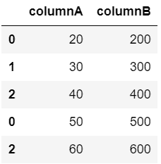

# 连接熊猫数据帧而不复制

> 原文:[https://www . geesforgeks . org/concatenate-pandas-data frames-不带副本/](https://www.geeksforgeeks.org/concatenate-pandas-dataframes-without-duplicates/)

在本文中，我们将使用*熊猫*模块连接两个数据帧。

为了执行两个数据帧的连接，我们将使用 *pandas.concat()。drop _ duplicates()*熊猫*模块中的*方法。

**分步方法:**

*   导入模块。
*   加载两个样本数据帧作为变量。
*   使用*熊猫连接数据帧。* 法降 _duplicates()。
*   显示生成的新数据帧。

**以下是一些示例，描述如何使用无重复的** ***【熊猫】*** **模块在两个数据帧之间执行拼接:**

**例 1:**

## 蟒蛇 3

```py
# Importing pandas library
import pandas as pd

# loading dataframes
dataframe1 = pd.DataFrame({'columnA': [20, 30, 40],
                           'columnB': [200, 300, 400]})

dataframe2 = pd.DataFrame({'columnA': [50, 20, 60],
                           'columnB': [500, 200, 600]})

# Concatenating dataframes without duplicates
new_dataframe = pd.concat([dataframe1, dataframe2]).drop_duplicates()

# Display concatenated dataframe
new_dataframe
```

**输出:**



这里，我们使用 *pandas.concat()* 方法连接了两个数据帧。

**例 2:**

## 蟒蛇 3

```py
# Importing pandas library
import pandas as pd

# loading dataframes
dataframe1 = pd.DataFrame({'name': ['rahul', 'anjali', 'kajal'],
                           'age': [23, 28, 30]})

dataframe2 = pd.DataFrame({'name': ['devesh', 'rashi', 'anjali'],
                           'age': [20, 15, 28]})

# Concatenating two dataframes wtithout duplicates
new_dataframe = pd.concat([dataframe1, dataframe2]).drop_duplicates()

# Resetting index
new_dataframe = new_dataframe.reset_index(drop=True)

# Display dataframe generated
new_dataframe
```