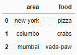
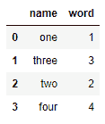

# 连接熊猫数据框的两列

> 原文:[https://www . geeksforgeeks . org/concatenate-两列熊猫-dataframe/](https://www.geeksforgeeks.org/concatenate-two-columns-of-pandas-dataframe/)

让我们讨论如何在 pandas python 中连接两列数据帧。我们可以通过使用以下函数来做到这一点:

*   concat()
*   追加()
*   加入()

**例 1 :** 使用 **`concat()`** 法。

```py
# importing the module
import pandas as pd

# creating 2 DataFrames
location = pd.DataFrame({'area': ['new-york', 'columbo', 'mumbai']})
food = pd.DataFrame({'food': ['pizza', 'crabs', 'vada-paw']})

# concatenating the DataFrames
det = pd.concat([location, food], join = 'outer', axis = 1)

# displaying the DataFrame
print(det)
```

**输出:**


**例 2 :** 使用 **`append()`** 法。

```py
# importing the module
import pandas as pd

# creating 2 DataFrames
first = pd.DataFrame([['one', 1], ['three', 3]], columns =['name', 'word'])
second = pd.DataFrame([['two', 2], ['four', 4]], columns =['name', 'word'])

# concatenating the DataFrames
dt = first.append(second, ignore_index = True)

# displaying the DataFrame
print(dt)
```

**输出:**


**示例 3 :** 使用。join()方法。

```py
# importing the module
import pandas as pd

# creating 2 DataFrames
location = pd.DataFrame({'area' : ['new-york', 'columbo', 'mumbai']})
food = pd.DataFrame({'food': ['pizza', 'crabs', 'vada-paw']})

# concatenating the DataFrames
dt = location.join(food)

# displaying the DataFrame
print(dt)
```

**输出:**


对于连接数据框中两列的三种方法，我们可以添加不同的参数来更改轴、排序、级别等。