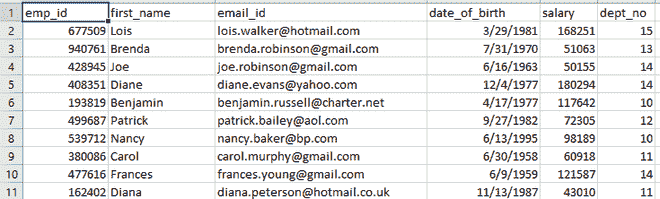
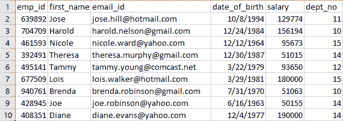
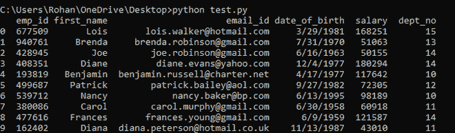
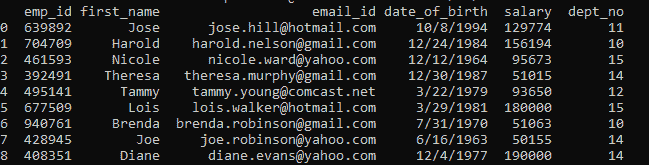
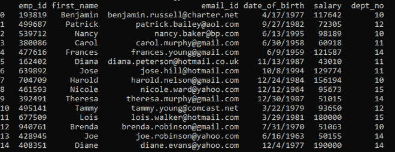
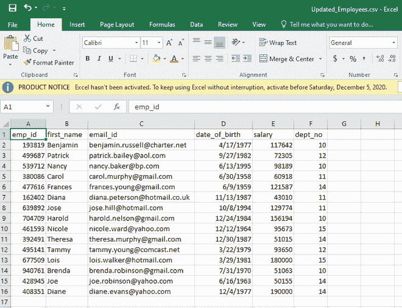
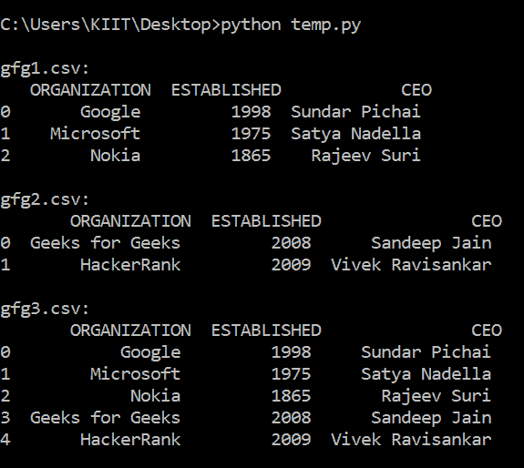
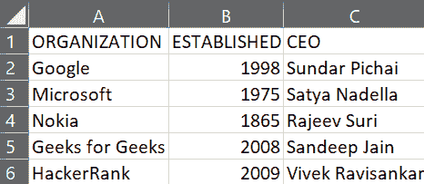

# 使用熊猫模块连接 CSV 文件

> 原文:[https://www . geesforgeks . org/concating-CSV-files-use-pandas-module/](https://www.geeksforgeeks.org/concatenating-csv-files-using-pandas-module/)

使用熊猫，我们可以对 CSV 文件执行各种操作，如追加、更新、连接等。在本文中，我们将使用*熊猫*模块连接两个 CSV 文件。

假设我们有一个。名为 *Employee.csv* 的 csv 文件，其中包含一些记录，如下所示:



Employee.csv

还有一个。名为*的 csv 文件已更新。csv* 包含新记录以及来自*员工. csv* 文件的少量记录，但信息已更新。文件如下:



Updated.csv

我们可以看到 *Updated.csv* 中的前五条记录都是新的，其余都有更新的信息。比如*路易*和*黛安*的工资有变化，*乔*的 *email_id* 不一样等等。

本文旨在将 *Updated.csv* 文件中的新记录和现有记录的信息更新到 *Employee.csv* 中。

**注意:**没有两个员工可以拥有相同的 *emp_id* 。

**方法:**每当涉及到使用 python 操纵数据时，我们都会使用 [**数据帧**](https://www.geeksforgeeks.org/python-pandas-dataframe/) 。使用了以下方法。

*   阅读 *Employee.csv* 并创建一个数据框，比如说 *employee_df..*
*   同样，从数据帧中读取 Updated.csv 和，比如说， *updated_df* 。
*   将*更新 _df* 连接到*员工 _df* ，并使用 *emp_id* 作为主键删除重复项。
*   创建新的。名为*的 csv 文件 Updated_Employees.csv* 包含所有旧的、新的以及更新的记录。

**例 1:**

## 蟒蛇 3

```
#import pandas
import pandas as pd

# read Employee file
employee_df = pd.read_csv('Employee.csv')

# print employee records
print(employee_df)

# read Updated file
updated_df = pd.read_csv('Updated.csv')

# print updated records
print(updated_df)

# form new dataframe by combining both employee_df and updated_df
# concat method appends records of updated_df to employee_df
# drop_duplicates method drop rows having same emp_id keeping 
# only the latest insertions
# resets the index to 0
final_dataframe = pd.concat([employee_df, updated_df]).drop_duplicates(
    subset='emp_id', keep='last').reset_index(drop=True)

# print old,new and updates records
print(final_dataframe)

# export all records to a new csv file
final_dataframe.to_csv(
    'Updated_Employees.csv', index=False)
```

**输出:**



员工 _df



已更新 _df



final _ data frame-结束 _ 资料档

下面是*的图片，已经提供了 Updated_Employee.csv* 。



已更新 _ 员工. csv

**示例:**

下面是将要连接的两个 CSV 文件:


gfg3.csv 文件


gfg2.csv 文件

现在执行下面的程序来连接上面的 CSV 文件。

## 蟒蛇 3

```
#import pandas
import pandas as pd

# read Employee file
df1 = pd.read_csv('gfg1.csv')

# print employee records
print('\ngfg1.csv:\n', df1)

# read Updated file
df2 = pd.read_csv('gfg2.csv')

# print updated records
print('\ngfg2.csv:\n', df2)

# form new dataframe by combining both employee_df
# and updated_df concat method appends records of
# updated_df to employee_df drop_duplicates method 
# drop rows having same emp_id keeping only the
# latest insertions resets the index to 0
final_df = pd.concat([df1, df2]).drop_duplicates(
    subset='ORGANIZATION').reset_index(drop=True)

# print old,new and updates records
print('\ngfg3.csv:\n', final_df)

# export all records to a new csv file
final_df.to_csv(
    'gfg3.csv', index=False)
```

**输出:**



下面是 *gfg3.csv:* 的图片



gfg3.csv 文件