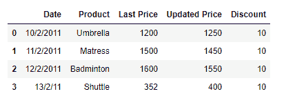
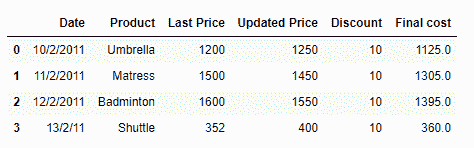
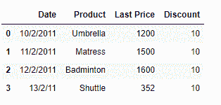
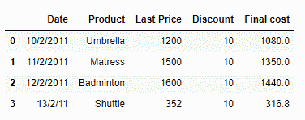

# 熊猫数据框列的条件操作

> 原文:[https://www . geesforgeks . org/conditional-operation-on-pandas-data frame-columns/](https://www.geeksforgeeks.org/conditional-operation-on-pandas-dataframe-columns/)

假设你有一个网上商店。产品价格经常更新。在计算产品的最终价格时，您会检查更新后的价格是否可用。如果不可用，则使用最后可用的价格。

**解决方案#1:** 我们可以使用条件表达式来检查列是否存在。如果它不存在，那么我们使用替代列计算价格。

```
# importing pandas as pd
import pandas as pd

# Create the dataframe
df = pd.DataFrame({'Date':['10/2/2011', '11/2/2011', '12/2/2011', '13/2/2011'],
                   'Product':['Umbrella', 'Matress', 'Badminton', 'Shuttle'],
                   'Last Price':[1200, 1500, 1600, 352],
                   'Updated Price':[1250, 1450, 1550, 400],
                   'Discount':[10, 10, 10, 10]})

# Print the dataframe
print(df)
```

**输出:**



现在我们将检查是否有更新的价格。如果没有，我们将在“最后价格”栏中应用 10%的折扣来计算最终价格。

```
# Check if the updated price is available or not
if 'Updated Price' in df.columns:
    df['Final cost'] = df['Updated Price'] - (df['Updated Price']*0.1)

else :
    df['Final cost'] = df['Last Price'] - (df['Last Price']*0.1)

# Print the Dataframe
print(df)
```

**输出:**


正如我们在输出中看到的，由于“更新价格”列可用，因此“最终成本”是根据更新后的价格计算的。

现在我们来考虑一个‘更新价格’不可用的场景。

```
# importing pandas as pd
import pandas as pd

# Create the dataframe
df = pd.DataFrame({'Date':['10/2/2011', '11/2/2011', '12/2/2011', '13/2/2011'],
                   'Product':['Umbrella', 'Matress', 'Badminton', 'Shuttle'],
                   'Last Price':[1200, 1500, 1600, 352],
                   'Discount':[10, 10, 10, 10]})

# Print the dataframe
print(df)
```

**输出:**



现在我们将检查是否有更新的价格。如果没有，我们将在“最后价格”栏中应用 10%的折扣来计算最终价格。

```
# Check if the updated price is available or not
if 'Updated Price' in df.columns:
    df['Final cost'] = df['Updated Price'] - (df['Updated Price']*0.1)

else :
    df['Final cost'] = df['Last Price'] - (df['Last Price']*0.1)

# Print the Dataframe
print(df)
```

**输出:**


**解决方案#2:** 我们可以使用 Python 的`issubset()`函数来检查集合中是否存在所需的列。

```
# importing pandas as pd
import pandas as pd

# Create the dataframe
df = pd.DataFrame({'Date':['10/2/2011', '11/2/2011', '12/2/2011', '13/2/2011'],
                   'Product':['Umbrella', 'Matress', 'Badminton', 'Shuttle'],
                   'Last Price':[1200, 1500, 1600, 352],
                   'Updated Price':[1250, 1450, 1550, 400],
                   'Discount':[10, 10, 10, 10]})

# Print the dataframe
print(df)
```

**输出:**


现在我们将检查是否有更新的价格。如果没有，我们将在“最后价格”栏中应用 10%的折扣来计算最终价格。

```
# Check if the updated price is available or not
if {'Updated Price', 'Discount'}.issubset(df.columns):
    df['Final cost'] = df['Updated Price'] - (df['Updated Price']*0.1)

elif {'Last Price', 'Discount'}.issubset(df.columns):
    df['Final cost'] = df['Last Price'] - (df['Last Price']*0.1)

# Print the Dataframe
print(df)
```

**输出:**

正如我们在输出中看到的，由于“更新价格”列可用，因此“最终成本”已经根据更新后的价格进行了计算。

现在让我们考虑一个“更新价格”不可用的情况。

```
# importing pandas as pd
import pandas as pd

# Create the dataframe
df = pd.DataFrame({'Date':['10/2/2011', '11/2/2011', '12/2/2011', '13/2/2011'],
                   'Product':['Umbrella', 'Matress', 'Badminton', 'Shuttle'],
                   'Last Price':[1200, 1500, 1600, 352],
                   'Discount':[10, 10, 10, 10]})

# Print the dataframe
print(df)
```

**输出:**


现在我们将检查是否有更新的价格。如果没有，我们将在“最后价格”栏中应用 10%的折扣来计算最终价格。

```
# Check if the updated price is available or not
if {'Updated Price', 'Discount'}.issubset(df.columns):
    df['Final cost'] = df['Updated Price'] - (df['Updated Price']*0.1)

elif {'Last Price', 'Discount'}.issubset(df.columns):
    df['Final cost'] = df['Last Price'] - (df['Last Price']*0.1)

# Print the Dataframe
print(df)
```

**输出:**

正如我们在输出中看到的，由于“更新价格”一栏不可用，所以“最终成本”是根据上次价格计算的。