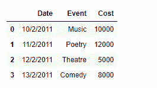
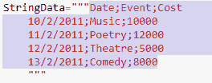

# 使用字符串数据构建熊猫的数据框架

> 原文:[https://www . geesforgeks . org/construct-a-data frame in-pandas-use-string-data/](https://www.geeksforgeeks.org/construct-a-dataframe-in-pandas-using-string-data/)

众所周知，数据有各种形状和大小。它们通常来自不同的来源，具有不同的格式。对于一个有抱负的数据科学家来说，非常重要的一点是，他们知道如何处理数据，即加载和存储各种格式的数据。

我们有一些字符串格式的数据，讨论如何将这些数据加载到熊猫数据框中。

**解决方案#1:** 实现这一点的一种方法是使用`StringIO()`功能。它将充当包装器，并帮助使用`pd.read_csv()`函数读取数据。

```
# importing pandas as pd
import pandas as pd

# import the StrinIO function
# from io module
from io import StringIO

# wrap the string data in StringIO function
StringData = StringIO("""Date;Event;Cost
    10/2/2011;Music;10000
    11/2/2011;Poetry;12000
    12/2/2011;Theatre;5000
    13/2/2011;Comedy;8000
    """)

# let's read the data using the Pandas
# read_csv() function
df = pd.read_csv(StringData, sep =";")

# Print the dataframe
print(df)
```

**输出:**

正如我们在输出中看到的，我们已经成功地将字符串格式的给定数据读取到熊猫数据帧中。

**解决方案 2 :** 另一个神奇的方法是使用熊猫`pd.read_clipboard()`功能。

```
# importing pandas as pd
import pandas as pd

# This is our string data
StringData ="""Date;Event;Cost
    10/2/2011;Music;10000
    11/2/2011;Poetry;12000
    12/2/2011;Theatre;5000
    13/2/2011;Comedy;8000
    """

# Now we copy the data to our clipboard.
```

**输出:**

这是我们把数据复制到剪贴板后的样子。

现在我们将使用熊猫`pd.read_clipboard()`函数将数据读入数据帧

```
# Read data 
df = pd.read_clipboard(sep = ';')

# Print the DataFrame
print(df)
```

**输出:**
