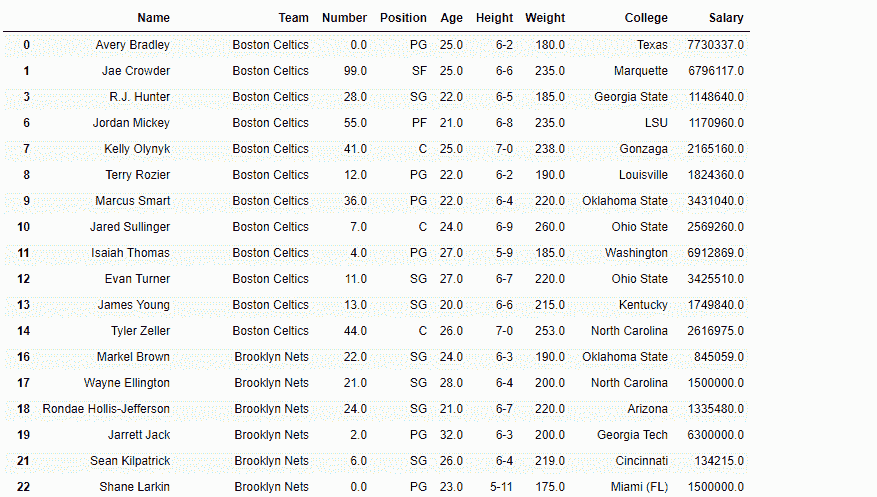
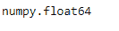
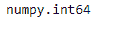
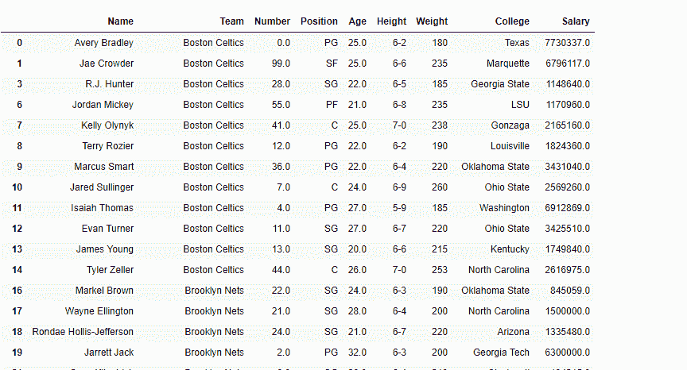

# 熊猫数据框中的转换功能

> 原文:[https://www . geesforgeks . org/conversion-functions-in-pandas-data frame/](https://www.geeksforgeeks.org/conversion-functions-in-pandas-dataframe/)

Python 是进行数据分析的优秀语言，主要是因为以数据为中心的 python 包的奇妙生态系统。Pandas 就是其中之一，它让数据的导入和分析变得更加容易。在本文中，我们使用“`nba.csv`”文件下载 CSV，点击这里的[。](https://media.geeksforgeeks.org/wp-content/uploads/nba.csv)


### 将熊猫对象转换为指定的数据类型

[DataFrame.astype()](https://www.geeksforgeeks.org/python-pandas-dataframe-astype/) 函数用于将熊猫对象转换为指定的数据类型。`astype()`函数还提供将任何合适的现有列转换为分类类型的功能。

**代码#1:** 转换重量列数据类型。

```py
# importing pandas as pd
import pandas as pd

# Making data frame from the csv file
df = pd.read_csv("nba.csv")

# Printing the first 10 rows of 
# the data frame for visualization

df[:10]
```


因为数据有一些“nan”值，所以为了避免任何错误，我们将删除所有包含任何`nan` 值的行。

```py
# drop all those rows which 
# have any 'nan' value in it.
df.dropna(inplace = True)
```



```py
# let's find out the data type of Weight column
before = type(df.Weight[0])

# Now we will convert it into 'int64' type.
df.Weight = df.We<strong>ight.astype('int64')

# let's find out the data type after casting
after = type(df.Weight[0])

# print the value of before
before

# print the value of after
after
```

**输出:**



```py
# print the data frame and see
# what it looks like after the change
df
```



### 为输入对象列推断更好的数据类型

[DataFrame . expert _ objects()](https://www.geeksforgeeks.org/python-pandas-dataframe-infer_objects/)函数试图为输入对象列推断更好的数据类型。此函数尝试对 object-dtyped 列进行软转换，保持非对象列和不可转换列不变。推理规则与正常的序列/数据帧构建期间相同。

**代码#1:** 使用`infer_objects()`函数推断更好的数据类型。

```py
# importing pandas as pd
import pandas as pd

# Creating the dataframe 
df = pd.DataFrame({"A":["sofia", 5, 8, 11, 100],
                   "B":[2, 8, 77, 4, 11],
                   "C":["amy", 11, 4, 6, 9]})

# Print the dataframe
print(df)
```

**输出:**


让我们看看 dataframe 中每一列的数据类型。

```py
# to print the basic info
df.info()
```


正如我们在输出中看到的，第一列和第三列是`object`类型。而第二列为`int64`型。现在对数据帧进行切片，并从中创建一个新的数据帧。

```py
# slice from the 1st row till end
df_new = df[1:]

# Let's print the new data frame
df_new

# Now let's print the data type of the columns
df_new.info()
```

**输出:**


正如我们在输出中看到的，列“A”和“C”是对象类型，即使它们包含整数值。那么，我们来试试`infer_objects()`功能。

```py
# applying infer_objects() function.
df_new = df_new.infer_objects()

# Print the dtype after applying the function
df_new.info()
```

**输出:**

现在，如果我们看一下每一列的数据类型，可以看到“A”和“C”列现在都是`int64`类型。

### 检测缺失值

[DataFrame.isna()](https://www.geeksforgeeks.org/python-pandas-dataframe-isna/) 函数用于检测缺失值。它返回一个相同大小的布尔对象，指示值是否为“无”。数值，如无或数值。NaN，映射到真值。其他的都被映射到假值。空字符串”或 numpy.inf 等字符不被视为 NA 值(除非您将 pandas . options . mode . use _ INF _ as _ NA 设置为 True)。

**代码#1:** 使用`isna()`功能检测数据帧中的缺失值。

```py
# importing pandas as pd
import pandas as pd

# Creating the dataframe 
df = pd.read_csv("nba.csv")

# Print the dataframe
df
```


让我们使用`isna()`功能来检测丢失的值。

```py
# detect the missing values
df.isna()
```

**输出:**

在输出中，缺失值对应的单元格包含真值否则为假。

### 检测现有/非缺失值

[DataFrame.notna()](https://www.geeksforgeeks.org/python-pandas-dataframe-notna/) 函数检测 DataFrame 中现有的/非缺失的值。该函数返回一个布尔对象，该对象的大小与应用它的对象的大小相同，指示每个单独的值是否是一个 *na* 值。所有非缺失值都被映射为 true，缺失值被映射为 false。

**代码#1:** 使用`notna()`函数查找数据帧中所有未缺失的值。

```py
# importing pandas as pd
import pandas as pd

# Creating the first dataframe 
df = pd.DataFrame({"A":[14, 4, 5, 4, 1],
                   "B":[5, 2, 54, 3, 2], 
                   "C":[20, 20, 7, 3, 8],
                   "D":[14, 3, 6, 2, 6]})

# Print the dataframe
print(df)
```


让我们使用`dataframe.notna()`函数来查找数据帧中所有未丢失的值。

```py
# find non-na values
df.notna()
```

**输出:**

正如我们在输出中看到的，数据框中所有未缺失的值都被映射为 true。没有错误值，因为数据帧中没有缺失值。

#### 数据帧中的转换方法

| 功能 | 描述 |
| **data frame . convert _ objects()** | 尝试为对象列推断更好的数据类型。 |
| **DataFrame.copy()** | 返回此对象的索引和数据的副本。 |
| **DataFrame.bool()** | 返回单个元素 PandasObject 的 bool。 |