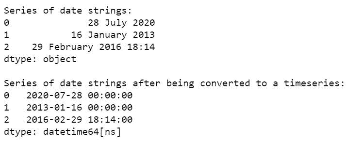
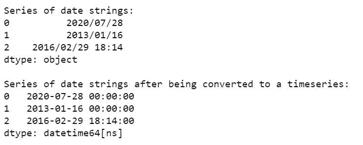
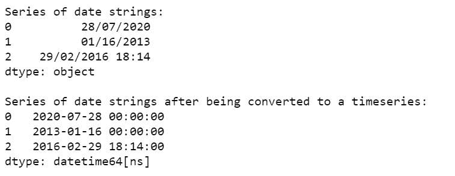
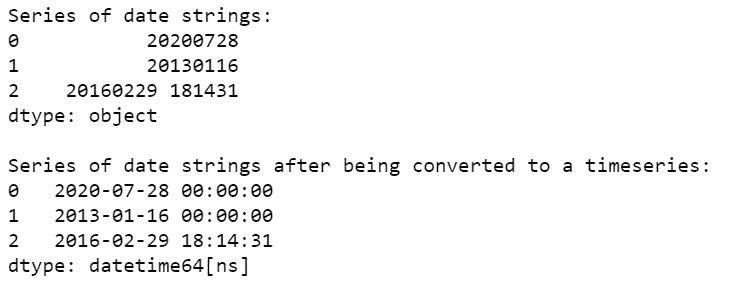
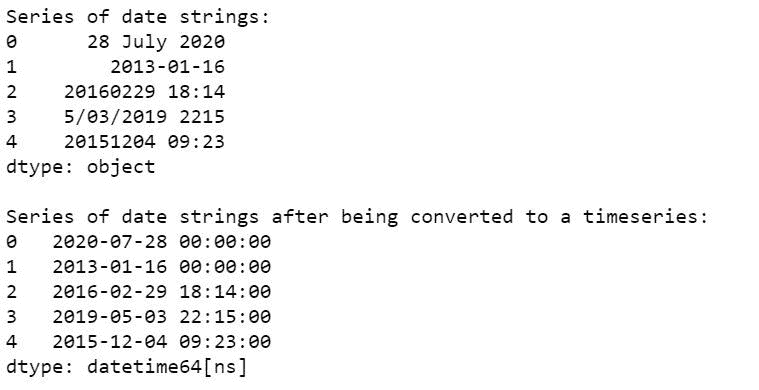

# 将熊猫数据框中的一系列日期字符串转换为时间序列

> 原文:[https://www . geesforgeks . org/convert-a-series-of-date-string-a-time-series-in-pandas-data frame/](https://www.geeksforgeeks.org/convert-a-series-of-date-strings-to-a-time-series-in-pandas-dataframe/)

在分析数据集的过程中，经常会发生日期没有以适当的类型表示，而是以简单的字符串形式出现的情况，这使得很难处理它们并对它们执行标准的日期时间操作。

[**pandas . to _ datetime()**](https://www.geeksforgeeks.org/python-pandas-to_datetime/)**函数有助于将日期字符串转换为 python 日期对象。因此，它可以用于将一系列日期字符串转换为时间序列。**

**我们来看一些例子:
**例 1:****

## **蟒蛇 3**

```
# import pandas library
import pandas as pd

# create a series of date strings
dt_series = pd.Series(['28 July 2020', '16 January 2013',
                       '29 February 2016 18:14'])

# display the series initially
print("Series of date strings:")
print(dt_series)

# display the series after being 
# converted to a time series
print("\nSeries of date strings after" + 
       " being converted to a timeseries:")

print(pd.to_datetime(dt_series))
```

****输出:****

****

****例 2:****

## **蟒蛇 3**

```
# import pandas library
import pandas as pd

# create a series of date strings
dt_series = pd.Series(['2020/07/28', '2013/01/16',
                       '2016/02/29 18:14'])

# display the series initially
print("Series of date strings:")
print(dt_series)

# display the series after being
# converted to a time series
print("\nSeries of date strings after " + 
      "being converted to a timeseries:")

print(pd.to_datetime(dt_series))
```

****输出:****

****

****例 3:****

## **蟒蛇 3**

```
# import pandas library
import pandas as pd

# create a series of date strings
dt_series = pd.Series(['2020-07-28', '2013-01-16', 
                       '2016-02-29 18:14'])

# display the series initially
print("Series of date strings:")
print(dt_series)

# display the series after 
# being converted to a time series
print("\nSeries of date strings after " +
      "being converted to a timeseries:")

print(pd.to_datetime(dt_series))
```

****输出:****

****

****例 4:****

## **蟒蛇 3**

```
# import pandas library
import pandas as pd

# create a series of date strings
dt_series = pd.Series(['28/07/2020', '01/16/2013', 
                       '29/02/2016 18:14'])

# display the series initially
print("Series of date strings:")
print(dt_series)

# display the series after being
# converted to a time series
print("\nSeries of date strings after " +
      "being converted to a timeseries:")

print(pd.to_datetime(dt_series))
```

****输出:****

****

****例 5:****

## **蟒蛇 3**

```
# import pandas library
import pandas as pd

# create a series of date strings
dt_series = pd.Series(['20200728', '20130116', 
                       '20160229 181431'])

# display the series initially
print("Series of date strings:")
print(dt_series)

# display the series after 
# being converted to a time series
print("\nSeries of date strings after " +
      "being converted to a timeseries:")

print(pd.to_datetime(dt_series))
```

****输出:****

****

****例 6:****

## **蟒蛇 3**

```
# import pandas library
import pandas as pd

# create a series of date strings
dt_series = pd.Series(['28 July 2020', '2013-01-16',
                       '20160229 18:14', '5/03/2019 2215',
                       '20151204 09:23'])

# display the series initially
print("Series of date strings:")
print(dt_series)

# display the series after 
# being converted to a time series
print("\nSeries of date strings after " + 
      "being converted to a timeseries:")

print(pd.to_datetime(dt_series))
```

****输出:****

****