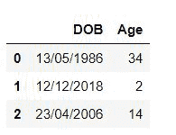

# 将熊猫的出生日期转换为年龄

> 原文:[https://www . geesforgeks . org/convert-出生日期到熊猫年龄/](https://www.geeksforgeeks.org/convert-birth-date-to-age-in-pandas/)

在这篇文章中，我们将把生日转换成熊猫数据框中的年龄。我们将使用熊猫和日期时间包将出生日期转换为年龄。要将出生日期转换为年龄，我们首先使用 **strptime()** 函数将给定日期转换为正确的格式，然后用出生日期年份减去当前年份，并检查出生月份和出生日期是否大于当前月份和当前日期，如果是真的，我们减去一，否则减去零。

**进场:**

*   首先，我们使用 strptime 函数将给定的日期格式识别为日期、月份和年份。
*   然后我们用 today 函数得到今天的日期。
*   为了得到年龄，我们从当年减去出生年份。这给出了以年为单位的年龄，但是，为了进一步计算准确的年龄，我们检查出生月份和出生日期是否大于当前月份和当前日期，如果该条件为真，我们从最终结果中减去 1，因为即使当前年份已经过去，但他的出生月份或出生日期仍未到达。

**示例 1:** 在本例中，我们将把单个给定日期转换为年龄。

## 蟒蛇 3

```py
from datetime import datetime, date

born='26/01/2000'
print("Born :",born)

#Identify given date as date month and year
born = datetime.strptime(born, "%d/%m/%Y").date()

#Get today's date
today = date.today()

print("Age :",
      today.year - born.year - ((today.month,
                                          today.day) < (born.month,
                                                        born.day)))
```

**输出:**

```py
Born : 26/01/2000
Age : 21
```

**说明:**在上面的代码中，我们使用了 datetime 包，导入了 datetime 和时间。我们使用 strptime 函数来识别存储在 born 变量中的日期，即我们将 2000 年 1 月 26 日识别为日期/月份/年份。然后我们用 today()函数得到今天的日期。为了得到年龄，我们使用了公式“今天.年-出生.年”((今天.月，今天.日)<(出生.月，出生.日)。在这种情况下，我们从出生年份中减去一个当前年份，然后如果当前日期和月份没有超过出生日期和月份，我们减去一个，因为他/她的出生日期和月份还没有到来。

**示例 2:** 现在我们将使用一个包含出生日期列的数据框，并将其转换为年龄，然后将该列添加到该数据框中。

## 蟒蛇 3

```py
import pandas as pd
from datetime import datetime, date

# Creating a list of date of birth
dob = {'DOB': ['13/05/1986', '12/12/2018', '23/04/2006']}

# Creating dataframe
df = pd.DataFrame(data = dob)

# This function converts given date to age
def age(born):
    born = datetime.strptime(born, "%d/%m/%Y").date()
    today = date.today()
    return today.year - born.year - ((today.month, 
                                      today.day) < (born.month, 
                                                    born.day))

df['Age'] = df['DOB'].apply(age)

display(df)
```

**输出:**



**说明:**在上面的代码中使用了熊猫和 datetime 包。我们创建了一个包含三行不同日期的数据帧。为了计算年龄，我们创建了一个年龄函数，它使用 strptime 函数以日期/月/年的格式识别日期。然后我们用 today()函数得到今天的日期。为了得到年龄，我们使用了公式“今天.年-出生.年”((今天.月，今天.日)<(出生.月，出生.日)。在这种情况下，我们从出生年份中减去一个当前年份，然后如果当前日期和月份没有超过出生日期和月份，我们减去一个，因为他/她的出生日期和月份还没有到来。我们在这个函数中返回年龄，它作为一个新行添加到“年龄”列中。稍后我们显示数据框。