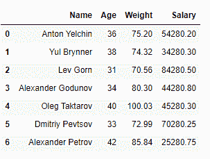
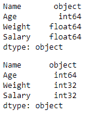
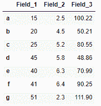
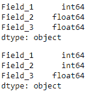
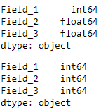

# 将熊猫数据框中的浮点数转换为整数

> 原文:[https://www . geesforgeks . org/convert-floats-to-整数 in-a-pandas-dataframe/](https://www.geeksforgeeks.org/convert-floats-to-integers-in-a-pandas-dataframe/)

让我们看看如何在熊猫数据帧中将浮点数转换为整数。我们将使用 [`astype()`](https://www.geeksforgeeks.org/python-pandas-dataframe-astype/) 方法来做到这一点。也可以使用 [`apply()`](https://www.geeksforgeeks.org/python-pandas-apply/) 方法完成。

**方法 1:使用`DataFrame.astype()`方法**

首先，我们将创建一个数据帧:

```py
# importing the library
import pandas as pd

# creating a DataFrame
list = [['Anton Yelchin', 36, 75.2, 54280.20], 
        ['Yul Brynner', 38, 74.32, 34280.30], 
        ['Lev Gorn', 31, 70.56, 84280.50],
        ['Alexander Godunov', 34, 80.30, 44280.80], 
        ['Oleg Taktarov', 40, 100.03, 45280.30],
        ['Dmitriy Pevtsov', 33, 72.99, 70280.25], 
        ['Alexander Petrov', 42, 85.84, 25280.75]]
df = pd.DataFrame(list, columns =['Name', 'Age', 'Weight', 'Salary'])
display(df)
```

**输出:**


**示例 1 :** 使用 **`DataFrame.astype()`** 将**一个**列从浮点转换为整数

```py
# displaying the datatypes
display(df.dtypes)

# converting 'Weight' from float to int
df['Weight'] = df['Weight'].astype(int)

# displaying the datatypes
display(df.dtypes)
```

**输出:**


**示例 2:** 使用`DataFrame.astype()`将多个列从浮点转换为整数

```py
# displaying the datatypes
display(df.dtypes)

# converting 'Weight' and 'Salary' from float to int
df = df.astype({"Weight":'int', "Salary":'int'}) 

# displaying the datatypes
display(df.dtypes)
```

**输出:**


**方法二:使用`DataFrame.apply()`方法**

首先，我们将创建一个数据框架。

```py
# importing the module
import pandas as pd

# creating a DataFrame
list = [[15, 2.5, 100.22], [20, 4.5, 50.21], 
        [25, 5.2, 80.55], [45, 5.8, 48.86], 
        [40, 6.3, 70.99], [41, 6.4, 90.25], 
        [51, 2.3, 111.90]]
df = pd.DataFrame(list, columns = ['Field_1', 'Field_2', 'Field_3'],
                  index = ['a', 'b', 'c', 'd', 'e', 'f', 'g'])
display(df)
```

**输出:**


**示例 1:** 使用`DataFrame.apply(np.int64)`将**单个**列从浮点转换为整数

```py
# importing the module
import numpy as np

# displaying the datatypes
display(df.dtypes)

# converting 'Field_2' from float to int
df['Field_2'] = df['Field_2'].apply(np.int64)

# displaying the datatypes
display(df.dtypes)
```

**输出:**


**示例 2:** 使用`DataFrame.apply(np.int64)`将多个列从浮点转换为整数

```py
# displaying the datatypes
display(df.dtypes)

# converting 'Field_2' and 'Field_3' from float to int
df['Field_2'] = df['Field_2'].apply(np.int64)
df['Field_3'] = df['Field_3'].apply(np.int64)

# displaying the datatypes
display(df.dtypes)
```

**输出:**
