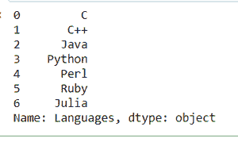
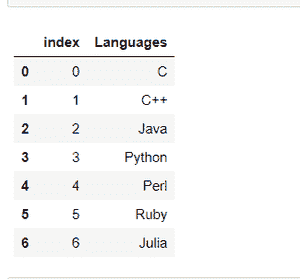
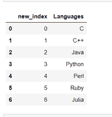

# 将给定的熊猫系列转换成数据帧，其索引作为数据帧上的另一列

> 原文:[https://www . geeksforgeeks . org/convert-given-pandas-series-to-data frame-with-its-index-on-另一列-on-data frame/](https://www.geeksforgeeks.org/convert-given-pandas-series-into-a-dataframe-with-its-index-as-another-column-on-the-dataframe/)

首先，让我们明白什么是熊猫[**系列**](https://www.geeksforgeeks.org/python-pandas-series/) 。熊猫系列是数组数据结构的类型。它是一维数据结构。它能够保存任何类型的数据，如字符串、整数、浮点等。可以使用系列构造函数创建系列。

> **语法:**熊猫。系列(数据、索引、数据类型、副本)
> 
> **返回:**系列对象。

现在，让我们创建一个熊猫系列:

## 蟒蛇 3

```py
# importing pandas package
import pandas as pd

# Creating Series of 
# programming languages
s = pd.Series(['C', 'C++', 'Java', 
               'Python', 'Perl', 'Ruby',
               'Julia'])

s
```

**输出:**



现在，我们将使用[**series . to _ frame()**](https://www.geeksforgeeks.org/python-pandas-series-to_frame/)和**[**data frame . reset _ index()**](https://www.geeksforgeeks.org/python-pandas-dataframe-reset_index/)方法将给定的 Pandas 系列转换为数据帧，其索引作为数据帧上的另一列。**

> ****语法:** Series.to_frame(名称=无)**
> 
> ****返回:**数据帧。**
> 
> ****语法:** Dataframe.reset_index(级别=无，删除=假，名称=无，就地=假)**
> 
>  ****返回:**数据帧。**

****示例 1:** 我们将把给定的 Pandas 系列转换成数据帧，其索引作为另一列。**

## **蟒蛇 3**

```py
# using series.to_frame to
# convert series to dataframe
df = s.to_frame().reset_index()

# show the dataframe
df
```

****输出:****

****

****示例 2:** 我们也可以重命名我们的索引列。**

## **蟒蛇 3**

```py
# Renaming our index column as 'new_index'
df.rename(columns = {'index':'new_index'},
          inplace = True)

# show the dataframe
df
```

****输出:****

****