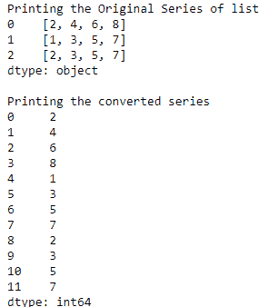
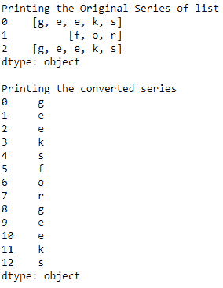

# 将熊猫系列列表转换为一个系列

> 原文:[https://www . geesforgeks . org/convert-series-of-list-to-one-series-in-pandas/](https://www.geeksforgeeks.org/convert-series-of-lists-to-one-series-in-pandas/)

在这个程序中，我们将看到如何将的一系列列表转换成一个系列，换句话说，我们只是将不同的列表合并成一个单一的列表，在 Pandas 中。我们将使用 stack()方法来执行这个任务。线路将为`Series.apply(Pandas.Series).stack().reset_index(drop = True)`。reset_index()方法将重置数据帧/序列的索引。

**示例 1 :** 合并多个整数序列列表。

```
# importing the module
import pandas as pd

# creating a Pandas series of lists
s = pd.Series([[2, 4, 6, 8],
               [1, 3, 5, 7],
               [2, 3, 5, 7]])
print("Printing the Original Series of list")
print(s)

# converting series of list into one series
s = s.apply(pd.Series).stack().reset_index(drop = True)

print("\nPrinting the converted series")
print(s)
```

**输出:**


**示例 2 :** 合并多个字符序列列表。

```
# importing the module
import pandas as pd

# creating a Pandas series of lists
s = pd.Series([['g', 'e', 'e', 'k', 's'],
               ['f', 'o', 'r'],
               ['g', 'e', 'e', 'k', 's']])
print("Printing the Original Series of list")
print(s)

# converting series of list into one series
s = s.apply(pd.Series).stack().reset_index(drop = True)

print("\nPrinting the converted series")
print(s)
```

**输出:**
