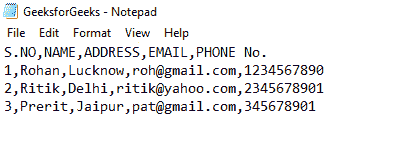
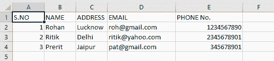
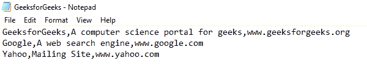
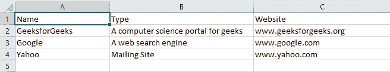
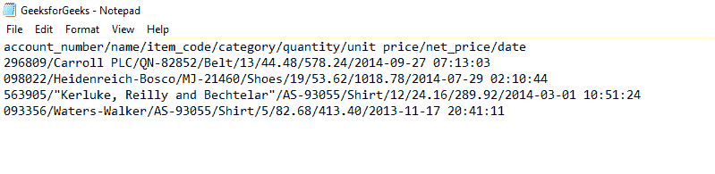
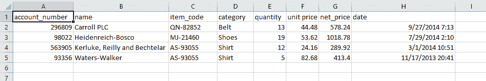

# 使用 Python 熊猫将文本文件转换为 CSV

> 原文:[https://www . geesforgeks . org/convert-text-file-to-CSV-using-python-pandas/](https://www.geeksforgeeks.org/convert-text-file-to-csv-using-python-pandas/)

让我们看看如何使用 Python 熊猫将文本文件转换为 CSV。Python 将从文本文件中读取数据，并将创建一个数据框，其行数等于文本文件中的行数，列数等于单行中的字段数。为了更好的理解，请看下面的例子。



原始文本文件

从上部文本文件创建的数据框如下所示:



由给定文本文件形成的 CSV 文件

**注意:**data frame 中的第一列是索引，这是读取文本文件时的默认设置。

一旦创建了数据帧，我们将使用[**data frame . to _ CSV()**](https://www.geeksforgeeks.org/how-to-export-pandas-dataframe-to-a-csv-file/)方法将该数据帧存储为 CSV 文件格式。

> **语法:** Dataframe.to_csv(参数)
> 
> **返回:**无

让我们看看例子:

**例 1:**

## 蟒蛇 3

```
# importing panda library
import pandas as pd

# readinag given csv file
# and creating dataframe
dataframe1 = pd.read_csv("GeeksforGeeks.txt")

# storing this dataframe in a csv file
dataframe1.to_csv('GeeksforGeeks.csv', 
                  index = None)
```

**输出:**


由给定文本文件形成的 CSV 文件

读取的文本文件同上。成功运行上述代码后，将在同一目录下创建一个名为“GeeksforGeeks.csv”的文件。

**示例 2:** 假设没有给出列标题，文本文件看起来像:



没有标题的文本文件

然后在编写代码时，您可以指定标题。

## 蟒蛇 3

```
# importing pandas library
import pandas as pd

# reading given csv file 
# and creating dataframe
websites = pd.read_csv("GeeksforGeeks.txt"
                       ,header = None)

# adding column headings
websites.columns = ['Name', 'Type', 'Website']

# store dataframe into csv file
websites.to_csv('GeeksforGeeks.csv', 
                index = None)
```

**输出:**



带有标题的 CSV 文件

我们看到标题已成功添加，文件已从“”转换。txt“格式化为”。' csv '格式。

**示例 3:** 在本例中，文本文件中的字段由用户定义的分隔符“/”分隔。



/'分隔文本文件

## 蟒蛇 3

```
# importing pandas library
import pandas as pd

# reading the given csv file 
# and creating dataframe
account = pd.read_csv("GeeksforGeeks.txt",
                      delimiter = '/')

# store dataframe into csv file
account.to_csv('GeeksforGeeks.csv',
               index = None)
```

**输出:**



CSV 文件

在读取数据时，我们指定数据应该使用指定的分隔符进行标记化。在这种情况下**“/”。**