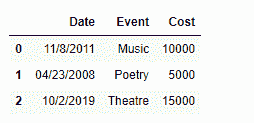
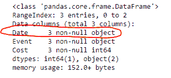
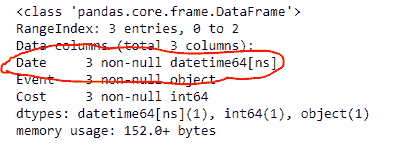
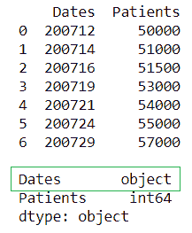
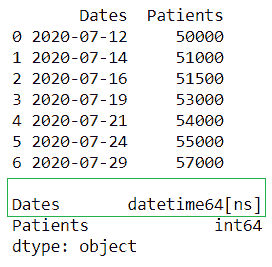
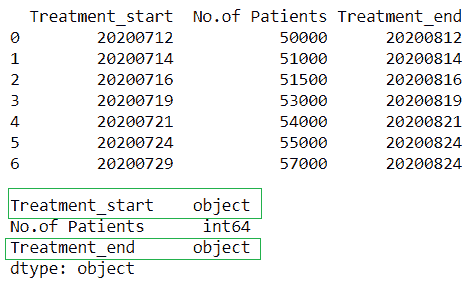
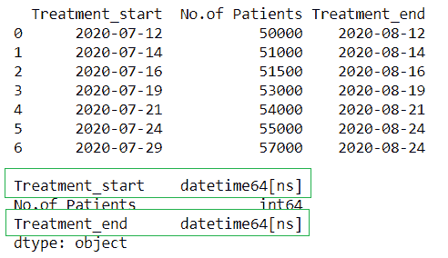

# 将熊猫数据框中的列类型从字符串转换为日期时间格式

> 原文:[https://www . geesforgeks . org/convert-the-column-type-from-string-to-datetime-format-in-pandas-data frame/](https://www.geeksforgeeks.org/convert-the-column-type-from-string-to-datetime-format-in-pandas-dataframe/)

在 Pandas 中处理数据时，遇到时间序列数据并不是一件不寻常的事情，我们知道 Pandas 是在 python 中处理时间序列数据的非常有用的工具。
让我们看看如何将字符串的 dataframe 列(采用 dd/mm/yyyy 格式)转换为 datetime 格式。如果日期格式不正确，我们就不能对其执行任何基于时间序列的操作。为了能够使用它，我们需要将日期转换为日期时间格式。

**代码#1 :** 使用 pd.to_datetime()函数将 Pandas dataframe 列类型从字符串转换为 datetime 格式。

## 蟒蛇 3

```py
# importing pandas as pd
import pandas as pd

# Creating the dataframe
df = pd.DataFrame({'Date':['11/8/2011', '04/23/2008', '10/2/2019'],
                'Event':['Music', 'Poetry', 'Theatre'],
                'Cost':[10000, 5000, 15000]})

# Print the dataframe
print(df)

# Now we will check the data type
# of the 'Date' column
df.info()
```

**输出:**




正如我们在输出中看到的，“日期”列的数据类型是对象，即字符串。现在我们将使用 pd.to_datetime()函数将其转换为 datetime 格式。

## 蟒蛇 3

```py
# convert the 'Date' column to datetime format
df['Date']= pd.to_datetime(df['Date'])

# Check the format of 'Date' column
df.info()
```

**输出:**



正如我们在输出中看到的，“日期”列的格式已更改为日期时间格式。

**代码#2:** 使用 DataFrame.astype()函数将 Pandas dataframe 列类型从字符串转换为日期时间格式。

## 蟒蛇 3

```py
# importing pandas as pd
import pandas as pd

# Creating the dataframe
df = pd.DataFrame({'Date':['11/8/2011', '04/23/2008', '10/2/2019'],
                'Event':['Music', 'Poetry', 'Theatre'],
                'Cost':[10000, 5000, 15000]})

# Print the dataframe
print(df)

# Now we will check the data type
# of the 'Date' column
df.info()
```

**输出:**

 

正如我们在输出中看到的，“日期”列的数据类型是对象，即字符串。现在我们将使用 DataFrame.astype()函数将其转换为日期时间格式。

## 蟒蛇 3

```py
# convert the 'Date' column to datetime format
df['Date'] = df['Date'].astype('datetime64[ns]')

# Check the format of 'Date' column
df.info()
```

**输出:**


正如我们在输出中看到的，“日期”列的格式已更改为日期时间格式。

**代码#3:** 如果数据帧列为‘yyymmdd’格式，我们必须将其转换为‘yyymmdd’格式

## 蟒蛇 3

```py
# importing pandas library
import pandas as pd

# Initializing the nested list with Data set
player_list = [['200712',50000],['200714',51000],['200716',51500],
            ['200719',53000],['200721',54000],
            ['200724',55000],['200729',57000]]

# creating a pandas dataframe
df = pd.DataFrame(player_list,columns=['Dates','Patients'])

# printing dataframe
print(df)
print()

# checking the type
print(df.dtypes)
```



## 蟒蛇 3

```py
# converting the string to datetime format
df['Dates'] = pd.to_datetime(df['Dates'], format='%y%m%d')

# printing dataframe
print(df)
print()

print(df.dtypes)
```



在上例中，我们将“日期”列的数据类型从“**对象**更改为“**日期时间 64【ns】**，格式从“yyymmdd”更改为“yyymmdd”。

**代码#4:** 使用 pandas.to_datetime()将多个**列从字符串转换为**格式****

## 蟒蛇 3

```py
# importing pandas library
import pandas as pd

# Initializing the nested list with Data set
player_list = [['20200712',50000,'20200812'],
               ['20200714',51000,'20200814'],
               ['20200716',51500,'20200816'],
               ['20200719',53000,'20200819'],
               ['20200721',54000,'20200821'],
               ['20200724',55000,'20200824'],
               ['20200729',57000,'20200824']]

# creating a pandas dataframe
df = pd.DataFrame(
  player_list,columns = ['Treatment_start',
                         'No.of Patients',
                         'Treatment_end'])

# printing dataframe
print(df)
print()

# checking the type
print(df.dtypes)
```



## 蟒蛇 3

```py
# converting the string to datetime
# format in multiple columns
df['Treatment_start'] = pd.to_datetime(
                          df['Treatment_start'],
                          format='%Y%m%d'
)
df['Treatment_end'] = pd.to_datetime(
                          df['Treatment_end'],
                          format='%Y%m%d'
)

# printing dataframe
print(df)
print()

print(df.dtypes)
```



在上例中，我们将列“**治疗 _ 开始**”和“**治疗 _ 结束**”的数据类型从“**对象**更改为“**日期时间 64【ns】**类型。