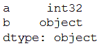
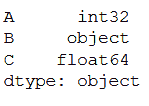

# 将 Pandas 列的数据类型转换为 int

> 原文:[https://www . geesforgeks . org/convert-the-data-type-of-pandas-column-to-int/](https://www.geeksforgeeks.org/convert-the-data-type-of-pandas-column-to-int/)

在本文中，我们将看到如何将 Pandas 列转换为 int。曾经有一只**熊猫。DataFrame** 是使用外部数据创建的，系统地将数字列作为数据类型对象，而不是 int 或 float，创建数字任务是不可能的。我们将传递任何 Python、Numpy 或 Pandas 数据类型来改变数据框的所有列类型，或者我们将传递以列名作为键、以数据类型作为值的字典来改变所选列的类型。

这里 **astype()** 函数使我们能够表达您需要的数据类型。它的适应性极强，即你可以尝试从一种类型转换到另一种类型。

**进场:**

*   进口熊猫
*   初始化数据帧
*   将函数应用于数据框列
*   打印列的数据类型

**例 1:**

我们首先使用标准语法导入 pandas 模块。然后，我们创建了一个数据帧，其值为 1、2、3、4，列索引为 a 和 b。接下来，我们使用 astype()方法转换了列类型。最终输出是转换后的列数据类型。

**代码:**

## 计算机编程语言

```py
import pandas as pd  

df = pd.DataFrame([["1", "2"], ["3", "4"]],
                  columns = ["a", "b"])

df["a"] = df["a"].astype(str).astype(int)

print(df.dtypes)
```

**输出:**



**例 2:**

我们首先使用标准语法导入 pandas 模块。然后我们创建了一个数据框架，其值为“A”:[1，2，3，4，5]，“B”:[‘A’、‘B’、‘C’、‘d’、‘e’、‘C’:[1.1’、‘1.0’、‘1.3’、‘2，5]和列索引为 A、B 和 C。我们使用名为 convert_dict 的字典来转换特定的列 A 和 C。我们将此数据框架命名为 df。接下来，我们使用 astype()方法转换列类型。最终输出是转换后的列数据类型。

## 计算机编程语言

```py
import pandas as pd  

# sample dataframe  
df = pd.DataFrame({'A': [1, 2, 3, 4, 5],
                   'B': ['a', 'b', 'c', 'd', 'e'],
                   'C': [1.1, '1.0', '1.3', 2, 5] })  

# using dictionary to convert specific columns  
convert_dict = {'A': int,
                'C': float }  

df = df.astype(convert_dict)  
print(df.dtypes)
```

**输出:**

