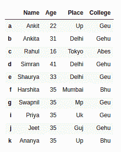

# 统计熊猫数据框中的所有行或满足某些条件的行

> 原文:[https://www . geesforgeks . org/count-all-row-or-那些满足熊猫某些条件的人-dataframe/](https://www.geeksforgeeks.org/count-all-rows-or-those-that-satisfy-some-condition-in-pandas-dataframe/)

让我们看看如何计算数据框中的所有行数或熊猫中满足条件的行数。

**1)使用[数据框形状计算熊猫数据框中的所有行。](https://www.geeksforgeeks.org/python-pandas-df-size-df-shape-and-df-ndim/)**

**`Dataframe.shape`** 返回数据帧/系列的形状元组(行、列)。

让我们创建一个熊猫数据框。

```py
# import pandas library as pd
import pandas as pd

# List of Tuples
students = [('Ankit', 22, 'Up', 'Geu'),
           ('Ankita', 31, 'Delhi', 'Gehu'),
           ('Rahul', 16, 'Tokyo', 'Abes'),
           ('Simran', 41, 'Delhi', 'Gehu'),
           ('Shaurya', 33, 'Delhi', 'Geu'),
           ('Harshita', 35, 'Mumbai', 'Bhu' ),
           ('Swapnil', 35, 'Mp', 'Geu'),
           ('Priya', 35, 'Uk', 'Geu'),
           ('Jeet', 35, 'Guj', 'Gehu'),
           ('Ananya', 35, 'Up', 'Bhu')
            ]

# Create a DataFrame object from
# list of tuples with columns
# and indices.
details = pd.DataFrame(students, columns =['Name', 'Age', 
                                           'Place', 'College'],
                        index =['a', 'b', 'c', 'd', 'e',
                                'f', 'g', 'i', 'j', 'k'])

details
```

**输出:**



**代码:**统计所有行

```py
# import pandas library as pd
import pandas as pd

# List of Tuples
students = [('Ankit', 22, 'Up', 'Geu'),
           ('Ankita', 31, 'Delhi', 'Gehu'),
           ('Rahul', 16, 'Tokyo', 'Abes'),
           ('Simran', 41, 'Delhi', 'Gehu'),
           ('Shaurya', 33, 'Delhi', 'Geu'),
           ('Harshita', 35, 'Mumbai', 'Bhu' ),
           ('Swapnil', 35, 'Mp', 'Geu'),
           ('Priya', 35, 'Uk', 'Geu'),
           ('Jeet', 35, 'Guj', 'Gehu'),
           ('Ananya', 35, 'Up', 'Bhu')
            ]

# Create a DataFrame object from
# list of tuples with columns
# and indices.
details = pd.DataFrame(students, columns =['Name', 'Age',
                                           'Place', 'College'],
                        index =['a', 'b', 'c', 'd', 'e', 
                                'f', 'g', 'i', 'j', 'k'])

# 0th index of tuple returned by shape
# attribute give the number
# of rows in a given dataframe
num_rows = details.shape[0]

print('Number of Rows in given dataframe : ',
      num_rows)
```

**输出:**

```py
Number of Rows in given dataframe :  10
```

**2)使用[数据帧索引](https://www.geeksforgeeks.org/how-to-get-rows-index-names-in-pandas-dataframe/)T3 统计熊猫数据帧中的所有行**

**`Dataframe.index`** 属性给出了一系列索引或行标签。

**代码:**

```py
import pandas as pd

# List of Tuples
students = [('Ankit', 22, 'Up', 'Geu'),
           ('Ankita', 31, 'Delhi', 'Gehu'),
           ('Rahul', 16, 'Tokyo', 'Abes'),
           ('Simran', 41, 'Delhi', 'Gehu'),
           ('Shaurya', 33, 'Delhi', 'Geu'),
           ('Harshita', 35, 'Mumbai', 'Bhu' ),
           ('Swapnil', 35, 'Mp', 'Geu'),
           ('Priya', 35, 'Uk', 'Geu'),
           ('Jeet', 35, 'Guj', 'Gehu'),
           ('Ananya', 35, 'Up', 'Bhu')
            ]

# Create a DataFrame object from
# list of tuples with columns
# and indices.
details = pd.DataFrame(students, columns =['Name', 'Age',
                                           'Place', 'College'],
                        index =['a', 'b', 'c', 'd', 'e',
                                'f', 'g', 'i', 'j', 'k'])

# count number of rows in given dataframe 
# by finding the length of indices
num_rows = len(details.index)

print('Number of Rows in given dataframe : ',
      num_rows)
```

**输出:**

```py
Number of Rows in given dataframe :  10
```

**3)使用[数据框应用()对熊猫数据框中满足条件的行进行计数。](https://www.geeksforgeeks.org/python-pandas-apply/)T3】**

**`Dataframe.apply()`** ，对数据帧的所有行应用函数，找出行的元素是否满足条件，根据结果返回一个布尔序列。

**代码:**

```py
# import pandas library as pd
import pandas as pd

# List of Tuples
students = [('Ankit', 22, 'Up', 'Geu'),
           ('Ankita', 31, 'Delhi', 'Gehu'),
           ('Rahul', 16, 'Tokyo', 'Abes'),
           ('Simran', 41, 'Delhi', 'Gehu'),
           ('Shaurya', 33, 'Delhi', 'Geu'),
           ('Harshita', 35, 'Mumbai', 'Bhu' ),
           ('Swapnil', 35, 'Mp', 'Geu'),
           ('Priya', 35, 'Uk', 'Geu'),
           ('Jeet', 35, 'Guj', 'Gehu'),
           ('Ananya', 35, 'Up', 'Bhu')
            ]

# Create a DataFrame object from
# list of tuples with columns
# and indices.
details = pd.DataFrame(students, columns =['Name', 'Age',
                                           'Place', 'College'],
                        index =['a', 'b', 'c', 'd', 'e', 
                                'f', 'g', 'i', 'j', 'k'])

# Get a bool series representing which row
# satisfies the condition i.e. True for
# row in which 'College' is 'Geu'
details = details.apply(lambda x : True
            if x['College'] == "Geu" else False, axis = 1)

# Count number of True in the series
num_rows = len(details[details == True].index)

print('Number of Rows in dataframe in which College is Geu : ',
      num_rows )
```

**输出:**

```py
Number of Rows in dataframe in which College is Geu :  4
```