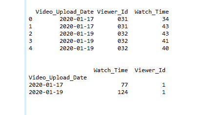
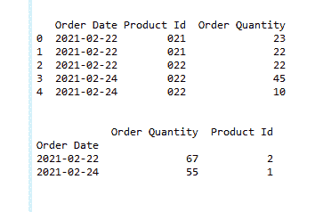

# 大熊猫聚集中的独特计数

> 原文:[https://www . geesforgeks . org/count-distinct-in-pandas-aggregation/](https://www.geeksforgeeks.org/count-distinct-in-pandas-aggregation/)

在这篇文章中，让我们看看如何在熊猫聚集中计算不同的数量。因此，为了计算熊猫聚合中的差异，我们将使用 groupby()和 add()方法。

*   [**group by():**](https://www.geeksforgeeks.org/python-pandas-dataframe-groupby/)**该方法用于根据一些标准将数据拆分成组。熊猫的物体可以在它们的任何一个轴上分开。我们可以创建一组类别，并对这些类别应用一个函数。分组的抽象定义是提供标签到组名的映射**
*   **[**【agg():**](https://www.geeksforgeeks.org/python-pandas-series-agg/)这个方法是用来传递一个函数或者函数列表，分别应用于一个数列甚至数列的每个元素。在函数列表的情况下，agg()方法会返回多个结果。**

**下面是一些描述如何在熊猫聚合中计算不同的例子:**

****例 1:****

## **计算机编程语言**

```
# import module
import pandas as pd
import numpy as np

# create Data frame
df = pd.DataFrame({'Video_Upload_Date': ['2020-01-17',
                                         '2020-01-17',
                                         '2020-01-19',
                                         '2020-01-19',
                                         '2020-01-19'],
                   'Viewer_Id': ['031', '031', '032',
                                 '032', '032'],
                   'Watch_Time': [34, 43, 43, 41, 40]})

# print original Dataframe
print(df)

# let's Count distinct in Pandas aggregation
df = df.groupby("Video_Upload_Date").agg(
    {"Watch_Time": np.sum, "Viewer_Id": pd.Series.nunique})

# print final output
print(df)
```

****输出:****

****

****例 2:****

## **计算机编程语言**

```
# import module
import pandas as pd
import numpy as np

# create Data frame
df = pd.DataFrame({'Order Date': ['2021-02-22',
                                  '2021-02-22',
                                  '2021-02-22',
                                  '2021-02-24',
                                  '2021-02-24'],
                   'Product Id': ['021', '021',
                                  '022', '022', '022'],
                   'Order Quantity': [23, 22, 22,
                                      45, 10]})

# print original Dataframe
print(df)

# let's Count distinct in Pandas aggregation
df = df.groupby("Order Date").agg({"Order Quantity": np.sum,
                                   "Product Id": pd.Series.nunique})

# print final output
print(df)
```

****输出:****

****