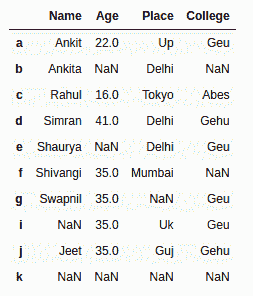
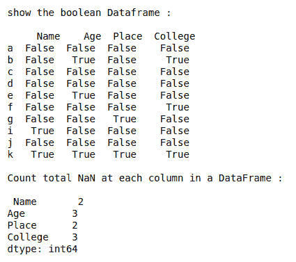
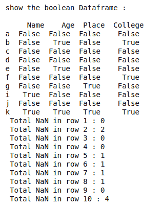
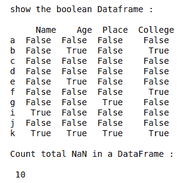

# 计算熊猫数据框中的 NaN 或缺失值

> 原文:[https://www . geesforgeks . org/count-nan-or-missing-values-in-pandas-data frame/](https://www.geeksforgeeks.org/count-nan-or-missing-values-in-pandas-dataframe/)

在本文中，我们将看到如何使用数据框的 **`isnull()`** 和 **`sum()`** 方法计算熊猫数据框中的 NaN 或缺失值。

## Dataframe.isnull()方法

熊猫`isnull()`功能检测给定对象中缺失的值。它返回一个相同大小的布尔对象，指示值是否为“无”。缺失值映射为真，非缺失值映射为假。

> **语法:**data frame . isnnull()
> 
> **参数:**无
> 
> **返回类型:**布尔值的数据框，对于 NaN 值为真，否则为假。

## dataframe.sum()方法

熊猫`sum()`函数返回所请求轴的数值总和。如果输入是索引轴，则它会将一列中的所有值相加，并对所有列重复相同的操作，然后返回一个包含每列中所有值之和的序列。它还支持在计算。

> **语法:** DataFrame.sum(轴=无，skipna =无，级别=无，numeric _ only =无，min_count=0，**kwargs)
> 
> **参数:**
> 
> *   **轴:**{索引(0)，列(1)}
> *   **skipna :** 计算结果时排除 NA/null 值。
> *   **级别:**如果轴是一个多索引(分层)，沿特定级别计数，折叠成一个系列
> *   **numeric_only :** 仅包括浮点、整型和布尔型列。如果没有，将尝试使用所有内容，然后只使用数字数据。不适用于系列。
> *   **min_count :** 执行操作所需的有效值数量。如果存在少于最小计数的非数值，结果将为“不适用”。
> 
> **返回:**系列或数据帧的总和(如果指定了级别)。

让我们创建一个熊猫数据框。

```py
# import numpy library as np
import numpy as np

# import pandas library as pd
import pandas as pd

# List of Tuples
students = [('Ankit', 22, 'Up', 'Geu'),
           ('Ankita', np.NaN, 'Delhi', np.NaN),
           ('Rahul', 16, 'Tokyo', 'Abes'),
           ('Simran', 41, 'Delhi', 'Gehu'),
           ('Shaurya', np.NaN, 'Delhi', 'Geu'),
           ('Shivangi', 35, 'Mumbai', np.NaN ),
           ('Swapnil', 35, np.NaN, 'Geu'),
           (np.NaN, 35, 'Uk', 'Geu'),
           ('Jeet', 35, 'Guj', 'Gehu'),
           (np.NaN, np.NaN, np.NaN, np.NaN)
            ]

# Create a DataFrame object from
# list of tuples with columns
# and indices.
details = pd.DataFrame(students, columns =['Name', 'Age', 
                                           'Place', 'College'],
                        index =['a', 'b', 'c', 'd', 'e', 
                                'f', 'g', 'i', 'j', 'k'])

details
```

**输出:**



**示例 1 :** 计算数据框中每一列的总 NaN。

```py
# import numpy library as np
import numpy as np

# import pandas library as pd
import pandas as pd

# List of Tuples
students = [('Ankit', 22, 'Up', 'Geu'),
           ('Ankita', np.NaN, 'Delhi', np.NaN),
           ('Rahul', 16, 'Tokyo', 'Abes'),
           ('Simran', 41, 'Delhi', 'Gehu'),
           ('Shaurya', np.NaN, 'Delhi', 'Geu'),
           ('Shivangi', 35, 'Mumbai', np.NaN ),
           ('Swapnil', 35, np.NaN, 'Geu'),
           (np.NaN, 35, 'Uk', 'Geu'),
           ('Jeet', 35, 'Guj', 'Gehu'),
           (np.NaN, np.NaN, np.NaN, np.NaN)
            ]

# Create a DataFrame object from list of tuples 
# with columns and indices.
details = pd.DataFrame(students, columns =['Name', 'Age',
                                           'Place', 'College'],
                        index =['a', 'b', 'c', 'd', 'e', 
                                'f', 'g', 'i', 'j', 'k'])

# show the boolean dataframe            
print(" \nshow the boolean Dataframe : \n\n", details.isnull())

# Count total NaN at each column in a DataFrame
print(" \nCount total NaN at each column in a DataFrame : \n\n",
      details.isnull().sum())
```

**输出:**



**示例 2 :** 计算数据框中每行的总 NaN。

```py
# import numpy library as np
import numpy as np

# import pandas library as pd
import pandas as pd

# List of Tuples
students = [('Ankit', 22, 'Up', 'Geu'),
           ('Ankita', np.NaN, 'Delhi', np.NaN),
           ('Rahul', 16, 'Tokyo', 'Abes'),
           ('Simran', 41, 'Delhi', 'Gehu'),
           ('Shaurya', np.NaN, 'Delhi', 'Geu'),
           ('Shivangi', 35, 'Mumbai', np.NaN ),
           ('Swapnil', 35, np.NaN, 'Geu'),
           (np.NaN, 35, 'Uk', 'Geu'),
           ('Jeet', 35, 'Guj', 'Gehu'),
           (np.NaN, np.NaN, np.NaN, np.NaN)
            ]

# Create a DataFrame object from
# list of tuples with columns
# and indices.
details = pd.DataFrame(students, columns =['Name', 'Age', 
                                           'Place', 'College'],
                        index =['a', 'b', 'c', 'd', 'e',
                                'f', 'g', 'i', 'j', 'k'])

# show the boolean dataframe            
print(" \nshow the boolean Dataframe : \n\n", details.isnull())

# index attribute of a dataframe
# gives index list 

# Count total NaN at each row in a DataFrame
for i in range(len(details.index)) :
    print(" Total NaN in row", i + 1, ":",
          details.iloc[i].isnull().sum())
```

**输出:**



**例 3 :** 统计数据帧中的总 NaN。

```py
# import numpy library as np
import numpy as np

# import pandas library as pd
import pandas as pd

# List of Tuples
students = [('Ankit', 22, 'Up', 'Geu'),
           ('Ankita', np.NaN, 'Delhi', np.NaN),
           ('Rahul', 16, 'Tokyo', 'Abes'),
           ('Simran', 41, 'Delhi', 'Gehu'),
           ('Shaurya', np.NaN, 'Delhi', 'Geu'),
           ('Shivangi', 35, 'Mumbai', np.NaN ),
           ('Swapnil', 35, np.NaN, 'Geu'),
           (np.NaN, 35, 'Uk', 'Geu'),
           ('Jeet', 35, 'Guj', 'Gehu'),
           (np.NaN, np.NaN, np.NaN, np.NaN)
            ]

# Create a DataFrame object from
# list of tuples with columns
# and indices.
details = pd.DataFrame(students, columns =['Name', 'Age', 
                                           'Place', 'College'],
                        index =['a', 'b', 'c', 'd', 'e',
                                'f', 'g', 'i', 'j', 'k'])

# show the boolean dataframe            
print(" \nshow the boolean Dataframe : \n\n", details.isnull())

# Count total NaN in a DataFrame
print(" \nCount total NaN in a DataFrame : \n\n",
       details.isnull().sum().sum())
```

**输出:**

