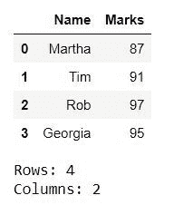

# 统计熊猫数据框的行数和列数

> 原文:[https://www . geeksforgeeks . org/count-熊猫的行数和列数-dataframe/](https://www.geeksforgeeks.org/count-the-number-of-rows-and-columns-of-pandas-dataframe/)

在本文中，我们将看到如何计算熊猫数据帧中的行数和列数。我们有不同的方法可以做到这一点。让我们借助例子来看看所有这些方法。

**示例 1:** 我们可以使用`**dataframe.shape**`来获得行数和列数。`dataframe.shape[0]`和`dataframe.shape[1]`分别给出行数和列数。

```py
# importing the module
import pandas as pd

# creating a DataFrame
dict = {'Name' : ['Martha', 'Tim', 'Rob', 'Georgia'],
        'Marks' : [87, 91, 97, 95]}
df = pd.DataFrame(dict)

# displaying the DataFrame
display(df)

# fetching the number of rows and columns
rows = df.shape[0]
cols = df.shape[1]

# displaying the number of rows and columns
print("Rows: " + str(rows))
print("Columns: " + str(cols))
```

**输出:**



**例 2 :** 我们可以用 **`len()`** 的方法得到行和列的计数。`dataframe.axes[0]`代表行，`dataframe.axes[1]`代表列。所以，`dataframe.axes[0]`和`dataframe.axes[1]`分别给出了行数和列数。

```py
# importing the module
import pandas as pd

# creating a DataFrame
dict = {'Name':['Martha', 'Tim', 'Rob', 'Georgia'],
        'Marks':[87, 91, 97, 95]}
df = pd.DataFrame(dict)

# displaying the DataFrame
display(df)

# fetching the number of rows and columns
rows = len(df.axes[0])
cols = len(df.axes[1])

# displaying the number of rows and columns
print("Rows: " + str(rows))
print("Columns: " + str(cols))
```

**输出:**


**例 3 :** 与例 2 类似，`**dataframe.index**` 代表行， `**dataframe.columns**` 代表列。所以，`len(dataframe.index)`和`len(dataframe.columns)`分别给出了行数和列数。

```py
# importing the module
import pandas as pd

# creating a DataFrame
dict = {'Name':['Martha', 'Tim', 'Rob', 'Georgia'],
        'Marks':[87, 91, 97, 95]}
df = pd.DataFrame(dict)

# displaying the DataFrame
display(df)

# fetching the number of rows and columns
rows = len(df.index)
cols = len(df.columns)

# displaying the number of rows and columns
print("Rows: " + str(rows))
print("Columns: " + str(cols))
```

**输出:**

