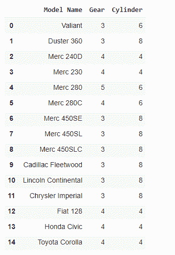

# 计算每组熊猫的唯一值

> 原文:[https://www . geesforgeks . org/count-unique-values-with-pands-per-group/](https://www.geeksforgeeks.org/count-unique-values-with-pandas-per-groups/)

**先决条件:**T2】熊猫

在这篇文章中，我们发现并计算熊猫组/栏中存在的唯一值。唯一值是指在数据集中仅出现一次的不同值，或者第一次出现的重复值被视为唯一值。

### 方法:

*   导入熊猫库。
*   使用 dataframe()函数导入或创建 [dataframe](https://www.geeksforgeeks.org/python-pandas-dataframe/) ，在该函数中，将数据作为参数传递，您要在该参数上创建 DataFrame，将其命名为“df”，或者对于导入数据集，使用 pandas.read_csv()函数，在该函数中传递数据集的路径和名称。
*   选择要在其中检查或计算唯一值的列。
*   为了找到唯一的值，我们使用了 pandas 提供的 unique()函数，并将其存储在一个变量中，名为“unique_values”。

> **语法:**pandas . unique(df(column _ name))或 df['column_name']。唯一的()

*   它将给出该组/列中存在的唯一值。
*   为了计算唯一值的数量，我们必须首先将名为“count”的变量 let 初始化为 0，然后必须为“unique_values”运行 For 循环，计算循环运行的次数，并将“count”的值增加 1
*   然后打印“计数”，该存储值是特定组/列中存在的唯一值的数量。
*   为了计算唯一值在特定列中重复的次数，我们使用了 Pandas 提供的 value_counts()函数。

> **语法:**pandas . value _ counts(df['column_name']或 df[' column _ name ']。value_counts()

*   这将给出每个唯一值在特定列中重复的次数。

为了更好地理解这个话题。让我们举一些例子，实现上面讨论的方法中的功能。

**示例 1:使用熊猫库创建数据帧。**

## 计算机编程语言

```py
# importing library
import pandas as pd

# storing the data of cars in the dictionary
car_data = {'Model Name': ['Valiant',
                           'Duster 360',
                           'Merc 240D',
                           'Merc 230',
                           'Merc 280',
                           'Merc 280C',
                           'Merc 450SE',
                           'Merc 450SL',
                           'Merc 450SLC',
                           'Cadillac Fleetwood',
                           'Lincoln Continental',
                           'Chrysler Imperial',
                           'Fiat 128',
                           'Honda Civic',
                           'Toyota Corolla'],

            'Gear': [3, 3, 4, 4, 5, 4, 3, 3,
                     3, 3, 3, 3, 4, 4, 4],

            'Cylinder': [6, 8, 4, 4, 6, 6, 8,
                         8, 8, 8, 8, 8, 4, 4, 4]}

# creating DataFrame for the data using
# pandas DataFrame function.
car_df = pd.DataFrame(car_data)

# printing the dataframe
car_df
```

**输出:**



**示例 2:打印每组中存在的唯一值。**

## 计算机编程语言

```py
# importing libraries
import pandas as pd

# storing the data of cars in the dictionary
car_data = {'Model Name': ['Valiant',
                           'Duster 360',
                           'Merc 240D',
                           'Merc 230',
                           'Merc 280',
                           'Merc 280C',
                           'Merc 450SE',
                           'Merc 450SL',
                           'Merc 450SLC',
                           'Cadillac Fleetwood',
                           'Lincoln Continental',
                           'Chrysler Imperial',
                           'Fiat 128',
                           'Honda Civic',
                           'Toyota Corolla'],

            'Gear': [3, 3, 4, 4, 5, 4, 3, 3,
                     3, 3, 3, 3, 4, 4, 4],

            'Cylinder': [6, 8, 4, 4, 6, 6, 8,
                         8, 8, 8, 8, 8, 4, 4, 4]}

# creating DataFrame for the data using pandas
car_df = pd.DataFrame(car_data)

# printing the unique values present in the Gear column
# finding unique values present
# in the Gear column using unique() function
print(f"Unique values present in Gear column are: {car_df['Gear'].unique()}")

# printing the unique values present
# in the Cylinder column
# finding unique values present in the
# Cylinder column using unique() function
print(f"Unique values present in Cylinder column are: {car_df['Cylinder'].unique()}")
```