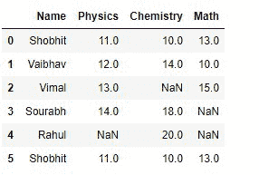
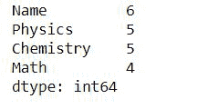
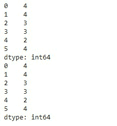
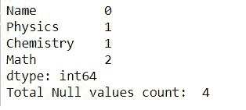
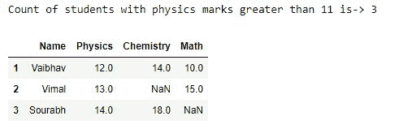
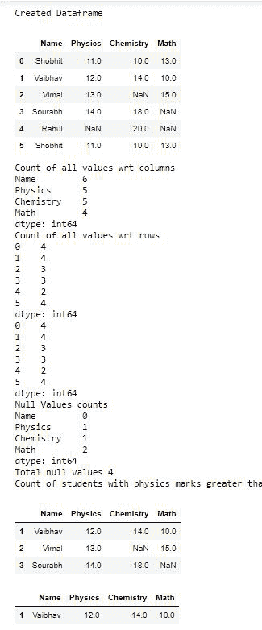

# 熊猫数据框中的计数值

> 原文:[https://www . geesforgeks . org/count-values-in-pandas-data frame/](https://www.geeksforgeeks.org/count-values-in-pandas-dataframe/)

在本文中，我们将计算熊猫数据框中的值。首先，我们将创建一个数据框，然后我们将计算不同属性的值。

> **语法:**数据帧计数(轴=0，级别=无，仅数值=假)
> 
> **参数:**
> 
> *   **轴** {0 或‘索引’，1 或‘列’}:如果轴=0 或轴=‘索引’，则默认为每列生成 0 计数，如果轴=1 或轴=‘列’，则为每行生成计数。
> *   **级别** (nt 或 str，可选):如果轴是多索引，沿特定级别计数，折叠成数据框。字符串指定级别名称。
> *   **numeric_only** (布尔值，默认为 False):仅包含 int、float 或布尔值。
> 
> **返回:**返回非空值的计数，如果使用了 level，则返回 dataframe

**循序渐进法:**

**步骤 1:** 导入库。

## 蟒蛇 3

```py
# importing libraries
import numpy as np
import pandas as pd
```

**步骤 2:** 创建数据帧

## 蟒蛇 3

```py
# Creating dataframe with
# some missing values
NaN = np.nan
dataframe = pd.DataFrame({'Name': ['Shobhit', 'Vaibhav',
                                   'Vimal', 'Sourabh',
                                   'Rahul', 'Shobhit'],
                          'Physics': [11, 12, 13, 14, NaN, 11],
                          'Chemistry': [10, 14, NaN, 18, 20, 10],
                          'Math': [13, 10, 15, NaN, NaN, 13]})

display(dataframe)
```

**输出:**



**创建的数据框**

**第三步:**在这一步中，我们只是简单地使用**。count()函数**对不同列的所有值进行计数。

## 蟒蛇 3

```py
# using dataframe.count()
# to count all values
dataframe.count()
```

**输出:**



我们可以看到计数值有差异，因为我们有缺失的值。“名称”列中有 5 个值，物理和化学有 4 个值，数学有 3 个值。在这种情况下，它使用带有默认值的参数。

**第 4 步:**如果我们想计算与行相关的所有值，那么我们必须传递 axis=1 或“columns”。

## 蟒蛇 3

```py
# we can pass either axis=1 or
# axos='columns' to count with respect to row
print(dataframe.count(axis = 1))

print(dataframe.count(axis = 'columns'))
```

**输出:**



**相对于行计数**

**第 5 步:**现在如果我们想计算数据帧中的空值。

## 蟒蛇 3

```py
# it will give the count
# of individual columns count of null values
print(dataframe.isnull().sum())

# it will give the total null
# values present in our dataframe
print("Total Null values count: ",
      dataframe.isnull().sum().sum())
```

**输出:**



**第六步:**。**使用的一些例子。count()**

现在我们要统计物理成绩大于 11 的学生人数。

## 蟒蛇 3

```py
# count of student with greater
# than 11 marks in physics
print("Count of students with physics marks greater than 11 is->",
      dataframe[dataframe['Physics'] > 11]['Name'].count())

# resultant of above dataframe
dataframe[dataframe['Physics']>11]
```

**输出:**



**物理> 11**

物理成绩大于 10，化学成绩大于 11，数学成绩大于 9 的学生数。

## 蟒蛇 3

```py
# Count of students whose physics marks
# are greater than 10,chemistry marks are
# greater than 11 and math marks are greater than 9.
print("Count of students ->",
      dataframe[(dataframe['Physics'] > 10) &
                (dataframe['Chemistry'] > 11) &
                (dataframe['Math'] > 9)]['Name'].count())

# dataframe of above result
dataframe[(dataframe['Physics'] > 10 ) &
          (dataframe['Chemistry'] > 11 ) &
          (dataframe['Math'] > 9 )]
```

**输出:**


**物理> 10，化学> 11，数学> 9**

**以下是完整实现:**

## 蟒蛇 3

```py
# importing Libraries
import pandas as pd
import numpy as np

# Creating dataframe using dictionary
NaN = np.nan
dataframe = pd.DataFrame({'Name': ['Shobhit', 'Vaibhav',
                                   'Vimal', 'Sourabh',
                                   'Rahul', 'Shobhit'],
                          'Physics': [11, 12, 13, 14, NaN, 11],
                          'Chemistry': [10, 14, NaN, 18, 20, 10],
                          'Math': [13, 10, 15, NaN, NaN, 13]})

print("Created Dataframe")
print(dataframe)

# finding Count of all columns
print("Count of all values wrt columns")
print(dataframe.count())

# Count according to rows
print("Count of all values wrt rows")
print(dataframe.count(axis=1))
print(dataframe.count(axis='columns'))

# count of null values
print("Null Values counts ")
print(dataframe.isnull().sum())
print("Total null values",
      dataframe.isnull().sum().sum())

# count of student with greater
# than 11 marks in physics
print("Count of students with physics marks greater than 11 is->",
      dataframe[dataframe['Physics'] > 11]['Name'].count())

# resultant of above dataframe
print(dataframe[dataframe['Physics'] > 11])
print("Count of students ->",
      dataframe[(dataframe['Physics'] > 10) &
                (dataframe['Chemistry'] > 11) &
                (dataframe['Math'] > 9)]['Name'].count())

print(dataframe[(dataframe['Physics'] > 10) &
                (dataframe['Chemistry'] > 11) &
                (dataframe['Math'] > 9)])
```

**输出:**

