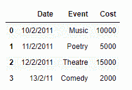
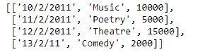
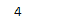
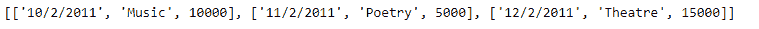

# 从熊猫数据框|集合 2

中的行创建列表

> 原文:[https://www . geesforgeks . org/create-a-list-from-row-in-pandas-data frame-set-2/](https://www.geeksforgeeks.org/create-a-list-from-rows-in-pandas-dataframe-set-2/)

在早期的帖子中，我们讨论了一些将数据帧的行提取为 Python 列表的方法。在这篇文章中，我们将看到更多实现这一目标的方法。

**注意:**要链接到代码中使用的 CSV 文件，请点击这里的。

**解决方案#1:** 为了访问熊猫数据框的每一行的数据，我们可以使用`DataFrame.iloc`属性，然后我们可以将每一行的数据附加到列表的末尾。

```
# importing pandas as pd
import pandas as pd

# Create the dataframe
df = pd.DataFrame({'Date':['10/2/2011', '11/2/2011', '12/2/2011', '13/2/11'],
                    'Event':['Music', 'Poetry', 'Theatre', 'Comedy'],
                    'Cost':[10000, 5000, 15000, 2000]})

# Print the dataframe
print(df)
```

**输出:**


现在我们将使用`DataFrame.iloc`属性来访问数据框中每一行的值，然后我们将从其中构建一个列表。

```
# Create an empty list
Row_list =[]

# Iterate over each row
for i in range((df.shape[0])):

    # Using iloc to access the values of 
    # the current row denoted by "i"
    Row_list.append(list(df.iloc[i, :]))

# Print the list
print(Row_list)
```

**输出:**

正如我们在输出中看到的，我们已经成功地将给定数据帧的每一行提取到一个列表中。就像任何其他 Python 的列表一样，我们可以对提取的列表执行任何列表操作。

```
# Find the length of the newly 
# created list
print(len(Row_list))

# Print the first 3 elements
print(Row_list[:3])
```

**输出:**



**解决方案#2:** 为了访问 Pandas 数据框的每一行的数据，我们可以使用`DataFrame.iat`属性，然后我们可以将每一行的数据追加到列表的末尾。

```
# importing pandas as pd
import pandas as pd

# Create the dataframe
df = pd.DataFrame({'Date':['10/2/2011', '11/2/2011', '12/2/2011', '13/2/11'],
                    'Event':['Music', 'Poetry', 'Theatre', 'Comedy'],
                    'Cost':[10000, 5000, 15000, 2000]})

# Create an empty list
Row_list =[]

# Iterate over each row
for i in range((df.shape[0])):
    # Create a list to store the data
    # of the current row
    cur_row =[]

    # iterate over all the columns
    for j in range(df.shape[1]):

        # append the data of each
        # column to the list
        cur_row.append(df.iat[i, j])

    # append the current row to the list
    Row_list.append(cur_row)

# Print the list
print(Row_list)
```

**输出:**


```
# Find the length of the newly 
# created list
print(len(Row_list))

# Print the first 3 elements
print(Row_list[:3])
```

**输出:**

