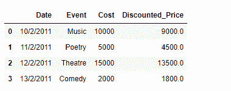

# 在熊猫数据框中基于现有列

创建一个新列

> 原文:[https://www . geesforgeks . org/create-a-new-in-column-pandas-data frame-基于现有的列/](https://www.geeksforgeeks.org/create-a-new-column-in-pandas-dataframe-based-on-the-existing-columns/)

在 Pandas 中处理数据时，我们对数据执行大量操作，以获得所需形式的数据。其中一个操作可能是，我们希望根据对数据框中现有列的一些操作的结果，在数据框中创建新列。让我们讨论几个可以做到这一点的方法。

给定一个包含事件数据的数据框架，我们希望创建一个名为*“折扣价”*的新列，该列是在对门票价格应用 10%的折扣后计算的。

**解决方案#1:** 我们可以使用`DataFrame.apply()`功能来实现这个任务。

```py
# importing pandas as pd
import pandas as pd

# Creating the DataFrame
df = pd.DataFrame({'Date':['10/2/2011', '11/2/2011', '12/2/2011', '13/2/2011'],
                    'Event':['Music', 'Poetry', 'Theatre', 'Comedy'],
                    'Cost':[10000, 5000, 15000, 2000]})

# Print the dataframe
print(df)
```

**输出:**


现在，我们将在对现有的“成本”列应用 10%的折扣后，创建一个名为“折扣价格”的新列。

```py
# using apply function to create a new column
df['Discounted_Price'] = df.apply(lambda row: row.Cost - 
                                  (row.Cost * 0.1), axis = 1)

# Print the DataFrame after addition
# of new column
print(df)
```

**输出:**


**解决方案#2:** 我们可以通过在所需的列元素上直接执行所需的操作来获得相同的结果。

```py
# importing pandas as pd
import pandas as pd

# Creating the DataFrame
df = pd.DataFrame({'Date':['10/2/2011', '11/2/2011', '12/2/2011', '13/2/2011'],
                    'Event':['Music', 'Poetry', 'Theatre', 'Comedy'],
                    'Cost':[10000, 5000, 15000, 2000]})

# Create a new column 'Discounted_Price' after applying
# 10% discount on the existing 'Cost' column.

# create a new column
df['Discounted_Price'] = df['Cost'] - (0.1 * df['Cost'])

# Print the DataFrame after 
# addition of new column
print(df)
```

**输出:**
