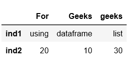
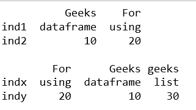

# 从字典列表中创建熊猫数据框

> 原文:[https://www . geesforgeks . org/create-a-pandas-data frame-from-list-dicts/](https://www.geeksforgeeks.org/create-a-pandas-dataframe-from-list-of-dicts/)

Pandas DataFrame 是一个二维标记数据结构，具有潜在的不同类型的列。它一般是熊猫最常用的对象。

熊猫数据框可以用多种方式创建。让我们讨论如何从字典列表中创建熊猫数据框。

**代码#1:**

```
# Python code demonstrate how to create  
# Pandas DataFrame by lists of dicts. 
import pandas as pd 

# Initialise data to lists. 
data = [{'Geeks': 'dataframe', 'For': 'using', 'geeks': 'list'},
        {'Geeks':10, 'For': 20, 'geeks': 30}] 

# Creates DataFrame. 
df = pd.DataFrame(data) 

# Print the data 
df 
```

**输出:**


**代码#2:** 带`index`

```
# Python code demonstrate how to create  
# Pandas DataFrame by lists of dicts. 
import pandas as pd 

# Initialise data to lists. 
data = [{'Geeks': 'dataframe', 'For': 'using', 'geeks': 'list'},
        {'Geeks':10, 'For': 20, 'geeks': 30}] 

# Creates DataFrame. 
df = pd.DataFrame(data, index =['ind1', 'ind2']) 

# Print the data 
df 
```

**输出:**


**代码#3:** 带`index`和`columns`

```
# Python code demonstrate how to create  
# Pandas DataFrame by lists of dicts. 
import pandas as pd 

# Initialise data to lists. 
data = [{'Geeks': 'dataframe', 'For': 'using', 'geeks': 'list'},
        {'Geeks':10, 'For': 20, 'geeks': 30}] 

# With two column indices, values same  
# as dictionary keys 
df1 = pd.DataFrame(data, index =['ind1', 'ind2'],
                      columns =['Geeks', 'For']) 

# With two column indices with  
# one index with other name 
df2 = pd.DataFrame(data, index =['indx', 'indy']) 

# print for first data frame 
print (df1, "\n") 

# Print for second DataFrame. 
print (df2) 
```

**输出:**
