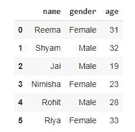

# 在熊猫中创建管道

> 原文:[https://www.geeksforgeeks.org/create-a-pipeline-in-pandas/](https://www.geeksforgeeks.org/create-a-pipeline-in-pandas/)

**管道**在转换和操纵大量数据方面发挥着有益的作用。管道是一系列的数据处理机制。Pandas 管道特性允许我们将各种用户定义的 Python 函数串在一起，以便构建一个数据处理管道。有两种方法可以在熊猫体内创建管道。通过呼叫**。管道()**功能，通过导入 **pdpipe** 包。

通过 pandas 管道函数，即 pipe()函数，我们可以一次调用多个函数，并在一行中进行数据处理。让我们通过使用 pipe()函数来理解和创建一个管道。

以下是描述如何使用熊猫创建管道的各种示例。

**例 1:**

## 蟒蛇 3

```
# importing pandas library
import pandas as pd

# Create empty dataframe
df = pd.DataFrame()

# Creating a simple dataframe
df['name'] = ['Reema', 'Shyam', 'Jai',
              'Nimisha', 'Rohit', 'Riya']
df['gender'] = ['Female', 'Male', 'Male',
                'Female', 'Male', 'Female']
df['age'] = [31, 32, 19, 23, 28, 33]

# View dataframe
df
```

**输出:**



现在，为数据处理创建函数。

## 蟒蛇 3

```
# function to find mean
def mean_age_by_group(dataframe, col):

    # groups the data by a column and
    # returns the mean age per group
    return dataframe.groupby(col).mean()

# function to convert to uppercase
def uppercase_column_name(dataframe):

    # Converts all the column names into uppercase
    dataframe.columns = dataframe.columns.str.upper()

    # And returns them
    return dataframe 
```

现在，使用。pipe()函数。

## 蟒蛇 3

```
# Create a pipeline that applies both the functions created above
pipeline = df.pipe(mean_age_by_group, col='gender').pipe(uppercase_column_name)

# calling pipeline
pipeline
```