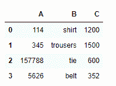

# 在熊猫中创建空数据框

> 原文:[https://www . geesforgeks . org/create-empty-data frame-in-pandas/](https://www.geeksforgeeks.org/create-empty-dataframe-in-pandas/)

熊猫[数据框](https://www.geeksforgeeks.org/python-pandas-dataframe/)是一个包含 2D 格式数据和标签的结构。DataFrames 广泛应用于数据科学、机器学习等领域。数据框与 SQL 表或 Excel 表相同，但使用起来更快。
空数据框可以在 [**熊猫的帮助下创建。DataFrame()**](https://www.geeksforgeeks.org/creating-a-pandas-dataframe/) 如下例所示:

> **语法:**熊猫。Dataframe()
> 
> **返回:**返回一个数据帧对象。

**代码:**

## 蟒蛇 3

```py
# import pandas library
import pandas as pd

# create an empty dataframe
my_df  = pd.DataFrame()

# show the dataframe
my_df
```

**输出:**


上面的输出没有显示任何内容，让我们向数据框插入一些标题。

**代码:**

## 蟒蛇 3

```py
# import pandas library
import pandas as pd

# column name list 
col_names =  ['A', 'B', 'C']

# create an empty dataframe
# with columns
my_df  = pd.DataFrame(columns = col_names)

# show the dataframe
my_df
```

**输出:**


只显示标题的空数据框。

现在让我们在数据帧中插入一些记录。
**代号:**

## 蟒蛇 3

```py
# import pandas library
import pandas as pd

# create a dataframe
my_df = pd.DataFrame({'A': ['114', '345',
                           '157788', '5626'], 
                      'B': ['shirt', 'trousers', 
                           'tie', 'belt'], 
                      'C': [1200, 1500, 
                           600, 352]}) 
# show the dataframe
my_df
```

**输出:**

