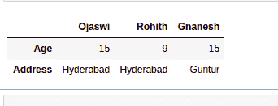
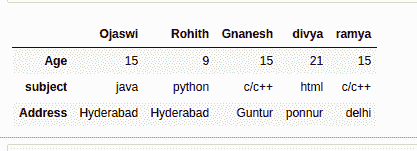

# 从词典中创建熊猫数据框

> 原文:[https://www . geesforgeks . org/create-pandas-data frame-from-dictionary/](https://www.geeksforgeeks.org/create-pandas-dataframe-from-dictionary-of-dictionaries/)

在本文中，我们将讨论如何从 Python 字典中创建熊猫数据框架。

## **方法一:使用** [**数据帧()**](https://www.geeksforgeeks.org/python-pandas-dataframe/)

我们可以使用熊猫创建一个数据帧。DataFrame()方法。

**语法:**

```
pandas.DataFrame(dictionary)
```

在哪里

*   熊猫是支持数据帧数据结构的模块
*   数据框架是将字典转换成数据框架的数据结构
*   字典是输入字典

**示例:**从词典中创建熊猫数据框。

## 蟒蛇 3

```
# import pandas module
import pandas

# create student dictionary of dictionaries 
# with 3 students with Age and address
data = {'Ojaswi': {'Age': 15, 'Address': 'Hyderabad'},
        'Rohith':  {'Age': 9, 'Address': 'Hyderabad'},
        'Gnanesh':  {'Age': 15, 'Address': 'Guntur'}}

# create pandas dataframe from dictionary of 
# dictionaries
data = pandas.DataFrame(data)

# display
print(data)
```

**输出:**



**示例 2:** 示例:从字典的字典中创建熊猫 Dataframe。

## 蟒蛇 3

```
# import pandas module
import pandas

# create student dictionary of dictionaries with
# 5 students with Age ,subject and  address
data = {'Ojaswi': {'Age': 15, 'subject': 'java', 'Address': 'Hyderabad'},
        'Rohith':  {'Age': 9, 'subject': 'python', 'Address': 'Hyderabad'},
        'Gnanesh':  {'Age': 15, 'subject': 'c/c++', 'Address': 'Guntur'},
        'divya':  {'Age': 21, 'subject': 'html', 'Address': 'ponnur'},
        'ramya':  {'Age': 15, 'subject': 'c/c++', 'Address': 'delhi'}}

# create pandas dataframe from dictionary of
# dictionaries
data = pandas.DataFrame(data)

# display
data
```

**输出:**



## **方法 2:使用 from_dict()**

**from_dict()** 用于转换字典中的数据帧

**语法:**

```
pandas.DataFrame.from_dict(dictionary)
```

其中，字典是字典的输入字典

**示例:**从字典中创建熊猫数据框。

## 蟒蛇 3

```
# import pandas module
import pandas

# create student dictionary of dictionaries with 3 
# students with Age and address
data = {'Ojaswi': {'Age': 15, 'Address': 'Hyderabad'},
        'Rohith':  {'Age': 9, 'Address': 'Hyderabad'},
        'Gnanesh':  {'Age': 15, 'Address': 'Guntur'}}

# create pandas dataframe from dictionary of dictionaries 
# using from_dict() method
data = pandas.DataFrame.from_dict(data)

# display
data
```

**输出:**

