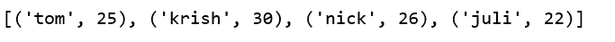

# 使用 zip 从列表中创建熊猫数据框

> 原文:[https://www . geesforgeks . org/create-pandas-data frame-from-list-using-zip/](https://www.geeksforgeeks.org/create-pandas-dataframe-from-lists-using-zip/)

创建熊猫数据框的方法之一是使用 [zip()](https://www.geeksforgeeks.org/zip-in-python/) 函数。

您可以使用列表创建元组列表，并从中创建字典。然后，这个字典可以用来构建一个数据框架。

[zip()](https://www.geeksforgeeks.org/zip-in-python/) 函数创建可用于一次生产一个项目的对象和。这个函数可以通过合并两个列表来创建 pandans 数据框。

假设有两个学生数据列表，第一个列表保存学生的姓名，第二个列表保存学生的年龄。那我们就可以，

```py
# List1
Name = ['tom', 'krish', 'nick', 'juli']

# List2
Age = [25, 30, 26, 22]
```

以上两个列表可以使用`list(zip())`功能进行合并。现在，通过调用`pd.DataFrame()`函数创建熊猫数据帧。

```py
# Python program to demonstrate creating
# pandas Datadaframe from lists using zip.

import pandas as pd

# List1
Name = ['tom', 'krish', 'nick', 'juli']

# List2
Age = [25, 30, 26, 22]

# get the list of tuples from two lists.
# and merge them by using zip().
list_of_tuples = list(zip(Name, Age))

# Assign data to tuples.
list_of_tuples 
```

**输出:**


```py
# Converting lists of tuples into
# pandas Dataframe.
df = pd.DataFrame(list_of_tuples, columns = ['Name', 'Age'])

# Print data.
df
```

**输出:**
