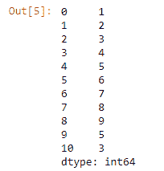
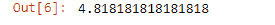
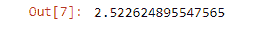
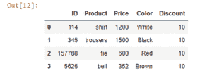
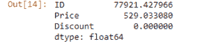

# 创建熊猫系列数据的平均值和标准差

> 原文:[https://www . geesforgeks . org/create-the-mean-and-standard-variance-of-the-data-of-pandas-series/](https://www.geeksforgeeks.org/create-the-mean-and-standard-deviation-of-the-data-of-a-pandas-series/)

**标准差**是方差的平方根。由西格玛表示的标准差是数字分布的度量。在熊猫中， **`std()`** 函数用来求数列的标准差。
**的意思是**可以简单地定义为数字的平均值。在熊猫中， **`mean()`** 函数用来寻找级数的平均值。

**例 1 :** 求熊猫系列的均值和标准差。

```
# importing the module
import pandas as pd

# creating a series
s = pd.Series(data = [5, 9, 8, 5, 7, 8, 1, 2, 3,
                      4, 5, 6, 7, 8, 9, 5, 3])

# displaying the series
print(s)
```

**输出:**


使用`mean()`函数求数列的平均值。

```
# finding the mean
print(s.mean())
```

**输出:**


使用`std()`函数求数列的标准差。

```
# finding the Standard deviation
print(s.std())
```

**输出:**


**例 2 :** 求熊猫数据帧的均值和标准差。

```
# importing the module
import pandas as pd

# creating a dataframe 
df = pd.DataFrame({'ID':[114, 345, 157788, 5626],
                   'Product':['shirt', 'trousers', 'tie', 'belt'],
                   'Color':['White', 'Black', 'Red', 'Brown'],
                   'Discount':[10, 10, 10, 10]})

# displaying the DataFrame
print(df)
```

**输出:**


使用`mean()`函数求数据帧的平均值。

```
# finding the mean
print(df.mean())
```

**输出:**


使用`std()`函数计算数据帧的标准偏差。

```
# finding the Standard deviation
print(df.std())
```

**输出:**
