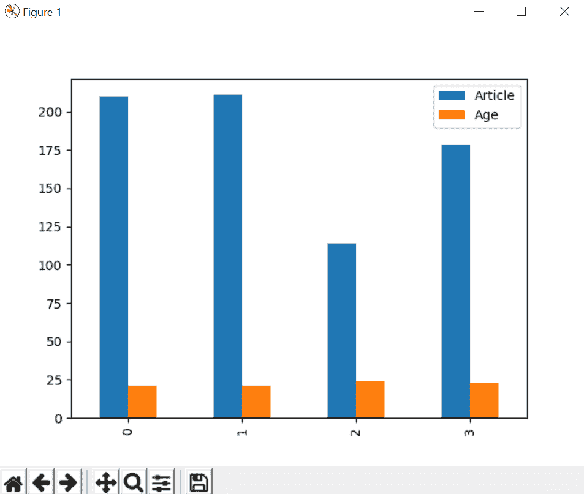

# 从熊猫系列

创建数据帧

> 原文:[https://www . geesforgeks . org/creating-a-data frame-from-pandas-series/](https://www.geeksforgeeks.org/creating-a-dataframe-from-pandas-series/)

[系列](https://www.geeksforgeeks.org/python-pandas-series/)是熊猫中的一类列表，可以取整数值、字符串值、双数值等。但是在[熊猫系列](https://www.geeksforgeeks.org/python-pandas-series/)中，我们以列表的形式返回一个对象，索引从 *0* 开始到 *n* ，其中 *n* 是系列值的长度。

在本文的后面，我们将讨论熊猫的数据帧，但是我们首先需要了解[系列](https://www.geeksforgeeks.org/python-pandas-series/)和[数据帧](https://www.geeksforgeeks.org/python-pandas-dataframe/)之间的主要区别。系列只能包含带有索引的单个列表，而数据帧可以由多个系列组成，或者我们可以说数据帧是可用于分析数据的系列的集合。

**代码#1:** **创建简单系列**

```
import pandas as pd
import matplotlib.pyplot as plt

author = ['Jitender', 'Purnima', 'Arpit', 'Jyoti']

auth_series = pd.Series(author)
print(auth_series)
```

**输出:**

```
0    Jitender
1     Purnima
2       Arpit
3       Jyoti
dtype: object

```

**我们来看看系列的类型:**

```
import pandas as pd
import matplotlib.pyplot as plt

author = ['Jitender', 'Purnima', 'Arpit', 'Jyoti']

auth_series = pd.Series(author)
print(type(auth_series))
```

**输出:**

```
<class 'pandas.core.series.Series'>

```

**代码#2:** **从系列**创建数据框

```
import pandas as pd
import matplotlib.pyplot as plt

author = ['Jitender', 'Purnima', 'Arpit', 'Jyoti']
article = [210, 211, 114, 178]

auth_series = pd.Series(author)
article_series = pd.Series(article)

frame = { 'Author': auth_series, 'Article': article_series }

result = pd.DataFrame(frame)

print(result)
```

**输出:**

```
     Author  Article
0  Jitender      210
1   Purnima      211
2     Arpit      114
3     Jyoti      178

```

**说明:**
我们正在合并两个系列*作者*和*文章发表*。创建一个字典，这样我们就可以组合系列的元数据。元数据是可以定义一系列值的数据的数据。把这个字典传给熊猫数据框，最后你可以看到两个系列的组合结果，即作者和文章数量。

**代码#3:** **如何在数据框**外部添加系列

```
import pandas as pd
import matplotlib.pyplot as plt

author = ['Jitender', 'Purnima', 'Arpit', 'Jyoti']
article = [210, 211, 114, 178]

auth_series = pd.Series(author)
article_series = pd.Series(article)

frame = { 'Author': auth_series, 'Article': article_series }

result = pd.DataFrame(frame)
age = [21, 21, 24, 23]

result['Age'] = pd.Series(age)

print(result)
```

**输出:**

```
     Author  Article  Age
0  Jitender      210   21
1   Purnima      211   21
2     Arpit      114   24
3     Jyoti      178   23

```

**说明:**
我们又增加了一个外部命名为作者*年龄*的系列，然后直接在熊猫数据框中增加了这个系列。请记住一件事，如果缺少任何值，那么默认情况下，它将被转换为`NaN`值，即默认情况下*为空*。

**代码#4:** **数据框中缺少值**

```
import pandas as pd
import matplotlib.pyplot as plt

author = ['Jitender', 'Purnima', 'Arpit', 'Jyoti']
article = [210, 211, 114, 178]

auth_series = pd.Series(author)
article_series = pd.Series(article)

frame = { 'Author': auth_series, 'Article': article_series }

result = pd.DataFrame(frame)
age = [21, 21, 23]

result['Age'] = pd.Series(age)

print(result)
```

**输出:**

```
     Author  Article   Age
0  Jitender      210  21.0
1   Purnima      211  21.0
2     Arpit      114  23.0
3     Jyoti      178   NaN

```

**代码#5:** **图表上的数据图**

使用`plot.bar()`我们创建了一个条形图。

```
import pandas as pd
import matplotlib.pyplot as plt

author = ['Jitender', 'Purnima', 'Arpit', 'Jyoti']
article = [210, 211, 114, 178]

auth_series = pd.Series(author)
article_series = pd.Series(article)

frame = { 'Author': auth_series, 'Article': article_series }

result = pd.DataFrame(frame)
age = [21, 21, 24, 23]

result['Age'] = pd.Series(age)

result.plot.bar()
plt.show()
```

**输出:**

