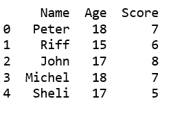
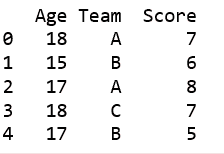
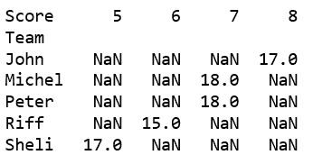

# 使用元组列表创建熊猫数据帧

> 原文:[https://www . geesforgeks . org/creating-a-pandas-data frame-use-list-of-tuples/](https://www.geeksforgeeks.org/creating-a-pandas-dataframe-using-list-of-tuples/)

我们可以从简单元组列表中创建一个 DataFrame，甚至可以选择我们想要使用的元组的特定元素。

**代码#1:** 简单地将元组传递给 DataFrame 构造函数。

```
# import pandas to use pandas DataFrame
import pandas as pd

# data in the form of list of tuples
data = [('Peter', 18, 7),
        ('Riff', 15, 6),
        ('John', 17, 8),
        ('Michel', 18, 7),
        ('Sheli', 17, 5) ]

# create DataFrame using data
df = pd.DataFrame(data, columns =['Name', 'Age', 'Score'])

print(df) 
```

**输出:**


**代码#2:** 使用`from_records()`

```
import pandas as pd

# data in the form of list of tuples
data = [('Peter', 18, 7),
        ('Riff', 15, 6),
        ('John', 17, 8),
        ('Michel', 18, 7),
        ('Sheli', 17, 5) ]

# create DataFrame using data
df = pd.DataFrame.from_records(data, columns =['Team', 'Age', 'Score'])

print(df) 
```

**输出:**


**代码#3:** 使用`from_items()`

```
import pandas as pd

# data in the form of list of tuples
data = [
('Age', [18, 15, 17, 18, 17]),
('Team', ['A', 'B', 'A', 'C', 'B']),
('Score', [7, 6, 8, 7, 5]),
]

# create DataFrame using data
df = pd.DataFrame.from_items(data)

print(df) 
```

**输出:**


**代码#4:** 为*枢转*成为可能。

```
# import pandas to use pandas DataFrame
import pandas as pd

# data in the form of list of tuples
data = [('Peter', 18, 7),
        ('Riff', 15, 6),
    ('John', 17, 8),
    ('Michel', 18, 7),
    ('Sheli', 17, 5) ]

# create DataFrame using data
df = pd.DataFrame(data, columns =['Team', 'Age', 'Score'])

a = df.pivot('Team', 'Score','Age')
print(a)
```

**输出:**
