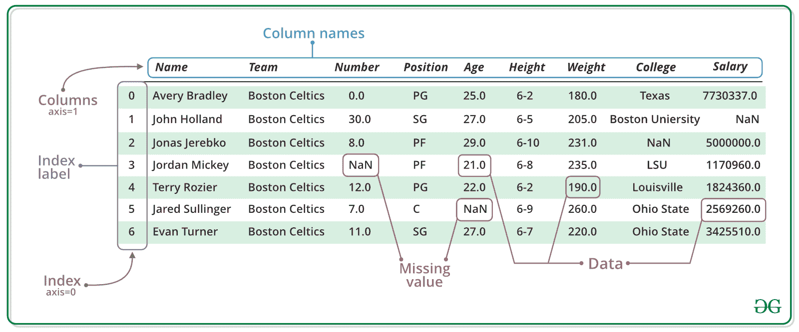
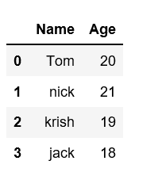

# 创建熊猫数据框

> 原文:[https://www.geeksforgeeks.org/creating-a-pandas-dataframe/](https://www.geeksforgeeks.org/creating-a-pandas-dataframe/)

在现实世界中，熊猫数据框架将通过从现有存储中加载数据集来创建，存储可以是 SQL 数据库、CSV 文件和 Excel 文件。熊猫数据框架可以从列表、字典和字典列表等创建。


数据框是一种二维数据结构，即数据以表格形式排列成行和列。在按行和列排列的数据框数据集中，我们可以在一个数据框中存储任意数量的数据集。我们可以对这些数据集执行许多操作，如算术运算、列/行选择、列/行添加等。



熊猫数据框可以用多种方式创建。让我们逐一讨论创建数据框的不同方法。
**创建空数据框:**
可以创建的基本数据框是空数据框。只需调用数据帧构造函数即可创建空数据帧。

## 蟒蛇 3

```py
# import pandas as pd
import pandas as pd

# Calling DataFrame constructor
df = pd.DataFrame()

print(df)
```

**输出:**

```py
Empty DataFrame
Columns: []
Index: []
```

[**使用列表**](https://www.geeksforgeeks.org/create-a-pandas-dataframe-from-lists/) **创建数据帧:**
数据帧可以使用单个列表或列表列表创建。

## 蟒蛇 3

```py
# import pandas as pd
import pandas as pd

# list of strings
lst = ['Geeks', 'For', 'Geeks', 'is',
            'portal', 'for', 'Geeks']

# Calling DataFrame constructor on list
df = pd.DataFrame(lst)
print(df)
```

**输出:**


[**从字典/列表中创建数据帧**](https://www.geeksforgeeks.org/python-create-a-pandas-dataframe-from-a-dict-of-equal-length-lists/) **:**
要从字典/列表中创建数据帧，所有的字典必须具有相同的长度。如果传递了索引，那么长度索引应该等于数组的长度。如果没有传递索引，那么默认情况下，索引将是范围(n)，其中 n 是数组长度。

## 蟒蛇 3

```py
# Python code demonstrate creating
# DataFrame from dict narray / lists
# By default addresses.

import pandas as pd

# initialise data of lists.
data = {'Name':['Tom', 'nick', 'krish', 'jack'], 'Age':[20, 21, 19, 18]}

# Create DataFrame
df = pd.DataFrame(data)

# Print the output.
print(df)
```

**输出:**



[**使用字典从列表中创建熊猫数据框**](https://www.geeksforgeeks.org/create-pandas-dataframe-from-lists-using-dictionary/) **:**
使用字典从列表中创建熊猫数据框可以通过不同的方式实现。我们可以使用 pandas.DataFrame 的字典从列表中创建 pandas dataframe。通过 pandas 中的这个方法，我们可以将列表的字典转换为数据帧。

## 蟒蛇 3

```py
# importing pandas as pd
import pandas as pd

# dictionary of lists
dict = {'name':["aparna", "pankaj", "sudhir", "Geeku"],
        'degree': ["MBA", "BCA", "M.Tech", "MBA"],
        'score':[90, 40, 80, 98]}

df = pd.DataFrame(dict)

print(df)
```

**输出:**


**创建数据框的多种方式:**

*   [创建熊猫数据框的不同方式](https://www.geeksforgeeks.org/different-ways-to-create-pandas-dataframe/)
*   [使用 zip 从列表中创建熊猫数据框](https://www.geeksforgeeks.org/create-pandas-dataframe-from-lists-using-zip/)
*   [从字典列表中创建熊猫数据框](https://www.geeksforgeeks.org/create-a-pandas-dataframe-from-list-of-dicts/)
*   [从一组等长的列表中创建熊猫数据框](https://www.geeksforgeeks.org/python-create-a-pandas-dataframe-from-a-dict-of-equal-length-lists/)
*   [使用列表](https://www.geeksforgeeks.org/create-a-pandas-dataframe-from-lists/)创建数据框
*   [使用字典从列表中创建熊猫数据框](https://www.geeksforgeeks.org/create-pandas-dataframe-from-lists-using-dictionary/)