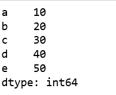
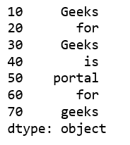
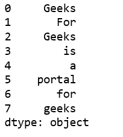

# 从列表中创建熊猫系列

> 原文:[https://www . geesforgeks . org/creating-a-pandas-series-from-list/](https://www.geeksforgeeks.org/creating-a-pandas-series-from-lists/)

A **`Series`** 是一个一维标注数组，能够保存任意数据类型(整数、字符串、浮点数、Python 对象等)。).必须记住，与 Python 列表不同，系列总是包含相同类型的数据。

让我们看看如何从列表中创建熊猫系列。

**方法#1 :** 使用`Series()`方法，没有任何参数。

```py
# import pandas as pd
import pandas as pd

# create Pandas Series with default index values
# default index ranges is from 0 to len(list) - 1
x = pd.Series(['Geeks', 'for', 'Geeks'])

# print the Series
print(x)
```

**输出:**


**方法#2 :** 使用`Series()`方法配合`'index'`参数。

```py
# import pandas lib. as pd
import pandas as pd

# create Pandas Series with define indexes
x = pd.Series([10, 20, 30, 40, 50], index =['a', 'b', 'c', 'd', 'e'])

# print the Series
print(x)
```

**输出:**


另一个例子:

```py
# import pandas lib. as pd
import pandas as pd

ind = [10, 20, 30, 40, 50, 60, 70]

lst = ['Geeks', 'for', 'Geeks', 'is',
            'portal', 'for', 'geeks']

# create Pandas Series with define indexes
x = pd.Series(lst, index = ind)

# print the Series
print(x)
```

**输出:**


**方法#3:** 使用多列表`Series()`方法

```py
# importing pandas 
import pandas as pd

# multi-list
list = [ ['Geeks'], ['For'], ['Geeks'], ['is'],
         ['a'], ['portal'], ['for'], ['geeks'] ]

# create Pandas Series
df = pd.Series((i[0] for i in list))

print(df)
```

**输出:**
