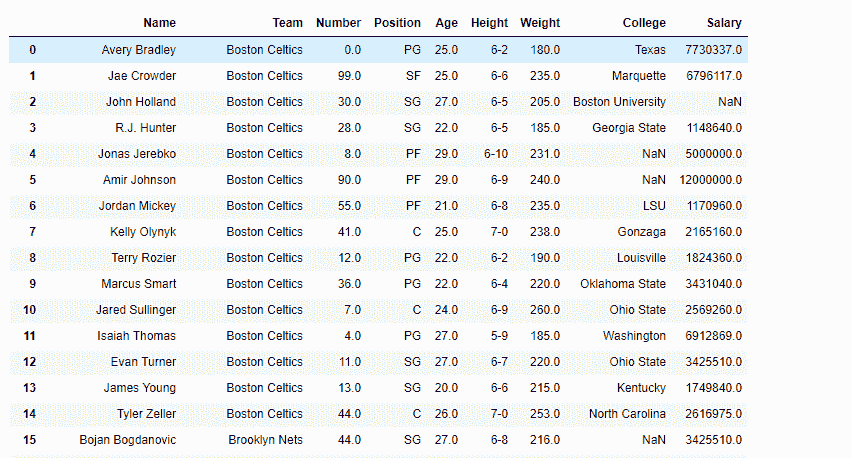
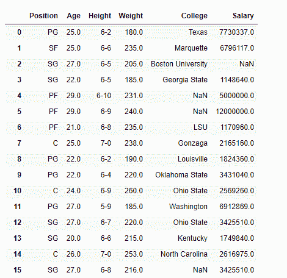
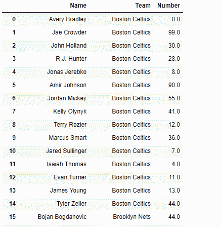
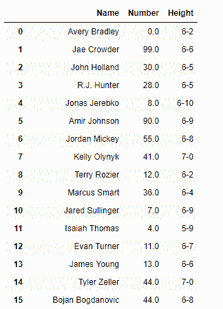

# 在熊猫数据框上创建视图

> 原文:[https://www . geesforgeks . org/creating-view-on-pandas-data frame/](https://www.geeksforgeeks.org/creating-views-on-pandas-dataframe/)

很多时候，在进行数据分析时，我们处理的是一个庞大的数据集，有很多属性。所有的属性不一定都同等重要。因此，我们希望只处理 dataframe 中的一组列。为此，让我们看看如何在 Dataframe 上创建视图，只选择那些我们需要的列，而留下其余的。

有关代码中使用的 CSV 文件的链接，请单击此处的。

**解决方案#1:** 可以通过删除所有不需要的列来选择数据框中的一组列。

```py
# importing pandas as pd
import pandas as pd

# Reading the csv file
df = pd.read_csv("nba.csv")

# Print the dataframe
print(df)
```

**输出:**


现在我们将选择除前三列之外的所有列。

```py
# drop the first three columns
df.drop(df.columns[[0, 1, 2]], axis = 1)
```

**输出:**



我们也可以使用要删除的列的名称。

```py
# drop the 'Name', 'Team' and 'Number' columns
df.drop(['Name', 'Team', 'Number'], axis = 1)
```

**输出:**


**解决方案#2 :** 我们可以单独选择我们需要的所有列，而省略其余的。

```py
# importing pandas as pd
import pandas as pd

# Reading the csv file
df = pd.read_csv("nba.csv")

# select the first three columns
# and store the result in a new dataframe
df_copy = df.iloc[:, 0:3]

# Print the new DataFrame
df_copy
```

**输出:**


我们也可以通过向`DataFrame.iloc`属性传递一个列表来随机选择列。

```py
# select the first, third and sixth columns
# and store the result in a new dataframe
# The numbering of columns begins from 0
df_copy = df.iloc[:, [0, 2, 5]]

# Print the new DataFrame
df_copy
```

**输出:**



或者，我们也可以命名我们想要选择的列。

```py
# Select the below listed columns
df_copy = df[['Name', 'Number', 'College']]

# Print the new DataFrame
df_copy
```

**输出:**

