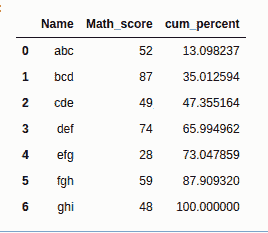
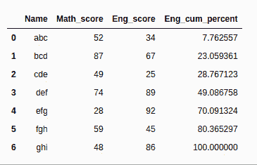

# 熊猫-蟒蛇一栏累计百分比

> 原文:[https://www . geesforgeks . org/累计-熊猫柱百分比-python/](https://www.geeksforgeeks.org/cumulative-percentage-of-a-column-in-pandas-python/)

累计百分比是通过将列的累计总和除以所有值的数学总和，然后将结果乘以 100 的数学公式计算出来的。这也适用于熊猫数据帧。
这里，预定义的 **cumsum()** 和 **sum()** 函数用于计算一列所有值的累计和和和。
**语法:**

> df[cum _ percent]= 100 *(df[' column _ name ']。cumsum()/df['column_name']。sum())

**例 1:**

## 蟒蛇 3

```py
import pandas as pd
import numpy as np

# Create a DataFrame
df1 = {
     'Name':['abc','bcd','cde','def','efg','fgh','ghi'],
   'Math_score':[52,87,49,74,28,59,48]}

df1 = pd.DataFrame(df1, columns=['Name','Math_score'])

# Computing Cumulative Percentage
df1['cum_percent'] = 100*(df1.Math_score.cumsum() / df1.Math_score.sum())

df1
```

**输出:**



**例 2:**

## 蟒蛇 3

```py
import pandas as pd
import numpy as np

# Create a DataFrame
df1 = {
     'Name':['abc','bcd','cde','def','efg','fgh','ghi'],
   'Math_score':[52,87,49,74,28,59,48],
  'Eng_score':[34,67,25,89,92,45,86]
}

df1 = pd.DataFrame(df1,columns=['Name','Math_score','Eng_score'])

# Computing cumulative Percentage
df1['Eng_cum_percent'] = (df1.Eng_score.cumsum() / df1.Eng_score.sum()) * 100

df1
```

**输出:**

