# 使用熊猫 GUI 进行数据探索

> 原文:[https://www . geesforgeks . org/data-exploration-use-pandas-GUI/](https://www.geeksforgeeks.org/data-exploration-using-pandas-gui/)

数据预处理是数据科学管道的一个重要部分，你需要找出数据中的各种不规则性，你操纵你的特征，等等。熊猫是我们经常用来处理数据的工具，还有用于数据可视化的 seaborn 和 matplotlib。PandasGUI 是一个库，它通过提供一个 GUI 界面使这项任务变得更加容易，该界面可用于

### 安装 PandasGUI

您可以使用 pip 命令像安装任何其他 python 库一样安装 PandasGUI。相同的命令是:-

```
pip install pandasgui
```

## **在盘大桂开 CSV**

要在 PandasGUI 中打开一个 CSV 文件，我们需要使用 **show()** 功能。让我们从和熊猫一起进口开始。点击此处获取[数据集](https://1drv.ms/u/s!Aj8gkZ6zsp8zguFBR8V_9r2fTnL3fQ?e=jd5GUe)。

## 蟒蛇 3

```
from pandasgui import show
import pandas as pd
```

接下来我们要做的是使用 **read_csv()** 将我们的 CSV 加载为数据帧，并将该数据帧作为参数传递到 **show()** 中。

## 蟒蛇 3

```
df = pd.read_csv('data.csv')
show(df)
```

**输出:**

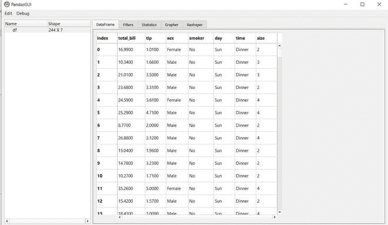

这是我们的数据框，我们可以滚动查看数据。您可以看到代表 NaN 值的空单元格。您可以通过单击单元格并编辑其值来编辑数据。只需单击列，就可以根据特定的列对数据框进行排序。在下图中，我们可以通过点击 **Total_bill** 栏对数据框进行排序。

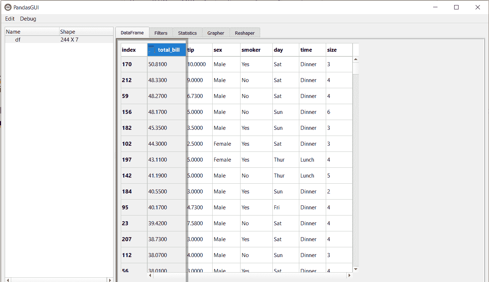

## PandasGUI 中的过滤器

假设我们希望看到 MSSubClass 的值大于或等于 120 的行。在熊猫中，我们可以使用以下命令做到这一点:-

## 蟒蛇 3

```
df[df['total_bill'] >= 40]
```

**输出:**

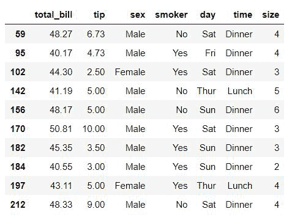

PandasGUI 为我们提供了过滤器，您可以在其中编写查询表达式来过滤数据。上面的查询表达式将是:

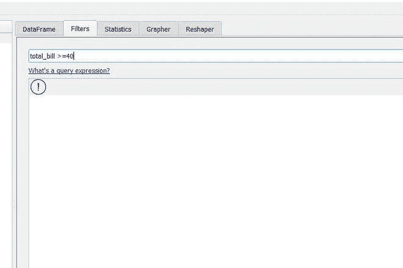

可以在 Filters 中编写这个查询表达式，点击**添加 Filter** 进行应用。让我们看看下图中的数据。如您所见，过滤器已成功应用。

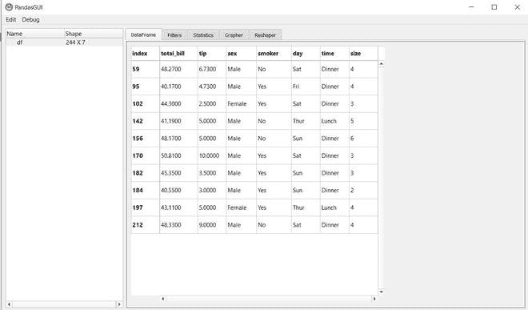

## 熊猫图形用户界面中的统计

汇总统计信息为您提供了数据分布的概述。在熊猫中，我们使用**description()**方法来获得数据的统计。

## 蟒蛇 3

```
df.describe()
```

**输出:**

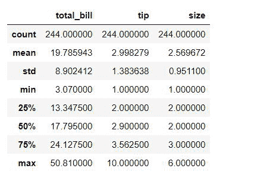

**在 PandasGUI 中，可以进入统计部分，获取每一列的统计数据。**

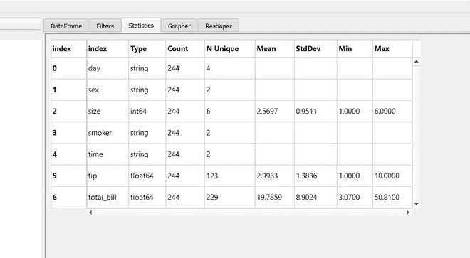

## PandasGUI 中的数据可视化

数据可视化不是熊猫通常使用的东西，我们使用 matplotlib、seaborn、plotly 等库。但是 PandasGUI 提供了在图示器部分使用绘图绘制的交互式图表。

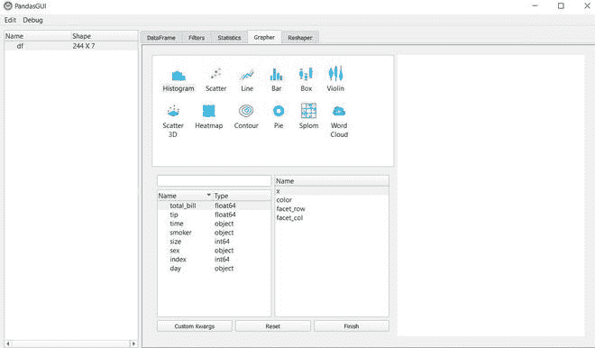

您可以绘制各种类型的图形，让我们通过将它拖放到 **x** 下来创建 total_bill 的直方图。

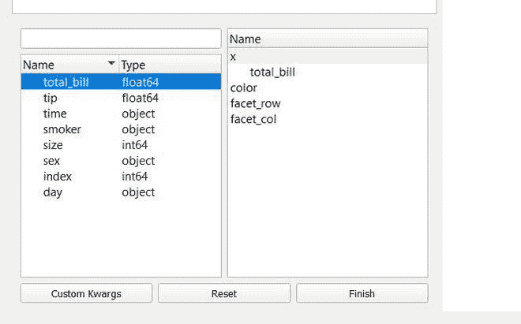

之后只需点击**完成**，你就可以看到你的图表了。

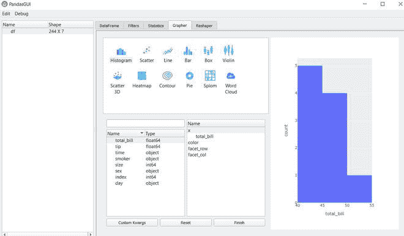

让我们来做一个条形图。

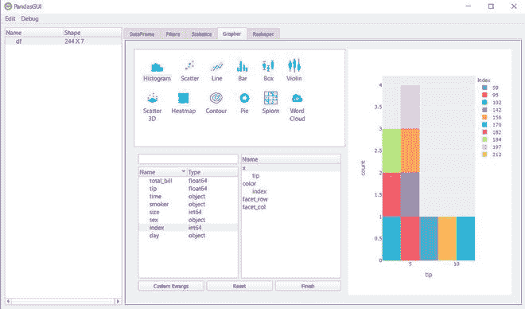

除此之外，您还可以创建箱线图、三维散点图、线图等。PandasGUI 是一个很好的工具，如果你想快速浏览你的数据，从检查汇总统计数据到绘制数据，你可以很容易地完成，而不需要编码。