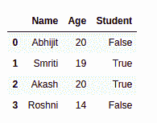
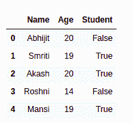
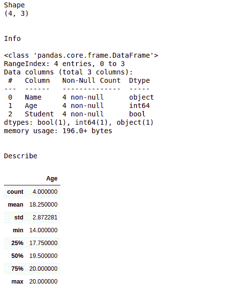

# 使用熊猫进行 Python 数据操作

> 原文:[https://www . geesforgeks . org/data-operating-in-python-use-pandas/](https://www.geeksforgeeks.org/data-manipulattion-in-python-using-pandas/)

在机器学习中，模型需要数据集来操作，即训练和测试。但是数据没有完全准备好，也没有准备好使用。在许多行和列中存在类似“Nan”/“Null”/“NA”值的差异。有时，数据集还包含一些行和列，这些在我们的模型操作中甚至不需要。在这种情况下，需要对数据集进行适当的清理和修改，使其成为我们模型的有效输入。我们通过在给模型输入数据之前练习“**数据争论**”来实现这一点。

好的，让我们深入到编程部分。我们的第一个目标是用 Python 创建一个[熊猫数据框架](https://www.geeksforgeeks.org/python-pandas-dataframe/)，你可能知道，熊猫是 Python 中使用最多的库之一。

**示例:**

```py
# importing the pandas library
import pandas as pd

# creating a dataframe object
student_register = pd.DataFrame()

# assigning values to the 
# rows and columns of the
# dataframe
student_register['Name'] = ['Abhijit', 
                            'Smriti',
                            'Akash',
                            'Roshni']

student_register['Age'] = [20, 19, 20, 14]
student_register['Student'] = [False, True,
                               True, False]

student_register
```

**输出:**



可以看到，dataframe 对象分别有四行`[0, 1, 2, 3]`和三列`[“Name”, “Age”, “Student”]`。包含索引值[0，1，2，3]的列称为**索引列**，这是熊猫数据报中的默认部分。我们也可以根据自己的需求改变这一点，因为 Python 功能强大。
接下来，出于某种原因，我们想要在数据报中添加一个新的学生，也就是说，您想要在现有的数据框中添加一个新的行，这可以通过下面的代码片段来实现。

一个重要的概念是 Python 的“数据框架”对象，由“系列”对象组成的行堆叠在一起形成一个表。因此，添加新行意味着创建一个新的 series 对象并将其附加到 dataframe。

**示例:**

```py
# creating a new pandas
# series object
new_person = pd.Series(['Mansi', 19, True], 
                       index = ['Name', 'Age', 
                                'Student'])

# using the .append() function
# to add that row to the dataframe
student_register.append(new_person, ignore_index = True)
```

**输出:**



在处理和争论任何数据之前，你需要得到它的总体概述，包括统计结论，如**标准偏差(std)，平均值及其四分位数分布**。此外，您需要知道每一列的确切信息，即它存储了什么类型的值，以及其中有多少是唯一的。有三个支持功能，`.shape`、`.info()`和`.describe()`，分别输出表格的形状、行和列的信息以及数据框的统计信息(仅限数字列)。

**示例:**

```py
# for showing the dimension 
# of the dataframe
print('Shape')
print(student_register.shape)

# showing info about the data 
print("\n\nInfo\n")
student_register.info()

# for showing the statistical 
# info of the dataframe
print("\n\nDescribe")
student_register.describe()
```

**输出:**



在上面的例子中，`.shape`函数给出了一个输出(4，3)，即创建的数据帧的大小。

**对`.info()`方法给出的输出描述如下:**

1.  **“range index”**描述关于索引列，即我们的数据报中的[0，1，2，3]。这是我们的数据框中的行数。
2.  顾名思义**“数据列”**给出总列数作为输出。
3.  **“姓名”、“年龄”、“学生”**是我们数据中的列名，“非空”告诉我们在对应的列中，不存在 NA/ Nan/ None 值存在。“object”、“int64”和“bool”是每列的数据类型。
4.  **“dtype”**向您概述了数据报中存在多少种数据类型，从而简化了数据清理过程。
    还有，在高端机器学习模型中，**“内存使用”**是一个重要的术语，我们不能忽视这一点。

**对`.describe()`方法给出的输出描述如下:**

1.  **计数**是数据帧中的行数。
2.  **平均值**是“年龄”栏中所有条目的平均值。
3.  **std** 是对应栏目的标准差。
4.  **min** 和 max 分别是该列中的最小值和最大值。
5.  25%、50%和 75%分别是**第一四分位数**、**第二四分位数(中位数)**和**第三四分位数**，这为我们提供了数据集分布的重要信息，并使 ML 模型的应用变得更加简单。